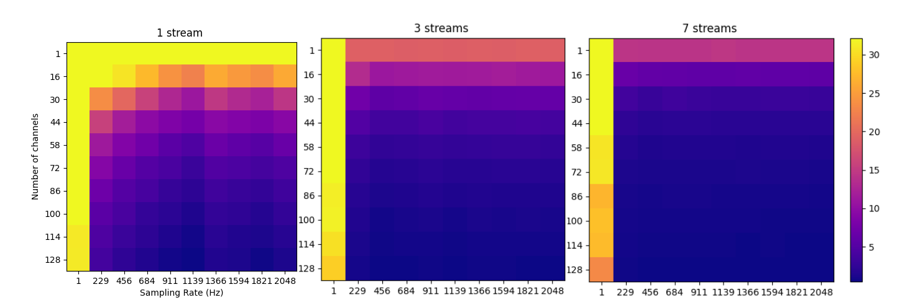
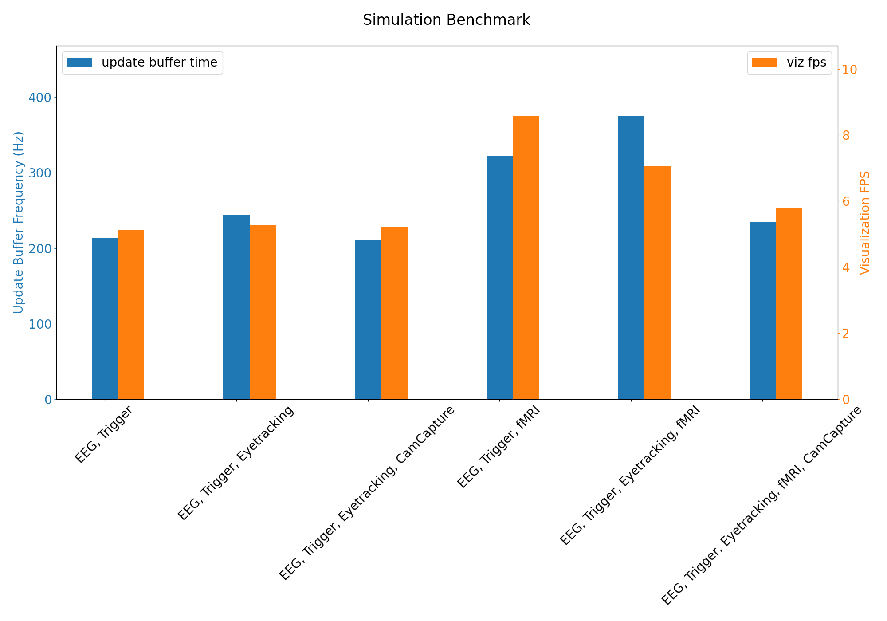

###################################
Real-time Performance
###################################

PhysioLab\ :sup:`XR` performs many real-time tasks. It essentially implements an real-time operating system (RTOS)
between its the incoming data stream and processing subroutines. By real-time, we emphasize on the ability of processing
subroutines able to finish their tasks in time for the next incoming data. This is a critical feature for many applications
in the field of physiological signal processing, when the data source emits data at a certain rate for which the downstream
system must be able to match.

For users for whom performance matters, this page will help you
understand the performance metrics of PhysioLab\ :sup:`XR`, its limitations, and in turn optimize the system you are building
with PhysioLab\ :sup:`XR`.

Benchmarks
**********

We benchmarked real-time features in PhysioLab\ :sup:`XR`.
Results here presented are obtained from a system with these specifications:
Windows 11 Pro, AMD Ryzen 9 5950X 3.4 GHz CPU, 128GB memory, and RTX 3090 GPU.
PhysioLab\ :sup:`XR`'s performance can varies based on the hardware configuration,
but the general trend remains the same (e.g., when a stream has a larger number of channels, the visualization FPS
is lower). When using PhysioLab\ :sup:`XR`, whether for visualization, recording, or more advance uses such as building
pipeline through the scripting interface, users are welcome to consult results here to optimize for their use case.

Stream Benchmark
----------------

PhysioLabXR's visualization frames per second (fps) with different number of streams (one, three, five, seven, and nine).
The benchmark is calculated for streams with number of channels ranging from 1 to 128, and sampling rate from 1 to 2028.
With sampling rate at 1 Hz, the system performs the best regardless of the number of streams and channels.
When the number of streams increases, the sampling rate of the streams being plotted have a major impact on the visualization fps.

Simulation Benchmark
--------------------

The simulation shows the app's performance on various combinations of data streams commonly found in physiological experiments.
The following table lists each stream's specification:

+------------+---------------+-------------+-----------+--------------------------+-----------------------------------+
| Stream     | Sampling Rate | Channels    | Data Type | Throughput (megabytes/s) | Reference System                  |
+------------+---------------+-------------+-----------+--------------------------+-----------------------------------+
| EEG        | 2048 Hz       | 64          | float32   | 0.524                    | BioSemi ActiveTwo                 |
+------------+---------------+-------------+-----------+--------------------------+-----------------------------------+
| Trigger    | 2048 Hz       | 1           | float32   | 0.00819                  | BioSemi ActiveTwo                 |
+------------+---------------+-------------+-----------+--------------------------+-----------------------------------+
| Eyetracker | 1200 Hz       | 51          | float32   | 0.245                    | Tobii Pro Spectrum                |
+------------+---------------+-------------+-----------+--------------------------+-----------------------------------+
| CamCapture | 30 Hz         | 1920×1080×3 | uint8     | 187                      | any 1080p color camera            |
+------------+---------------+-------------+-----------+--------------------------+-----------------------------------+
| fMRI       | 2 Hz          | 64×64×42    | float32   | 14.5                     | Siemens Prisma                    |
+------------+---------------+-------------+-----------+--------------------------+-----------------------------------+

We hope this benchmark can provide a reference for users to estimate the performance of their system. The script for benchmarking
is `here <https://github.com/PhysioLabXR/PhysioLabXR/blob/master/tests/PerformanceBenchmark.py>`_.  :ref:`Advanced users <contribute>` can use it to
benchmark their own system.