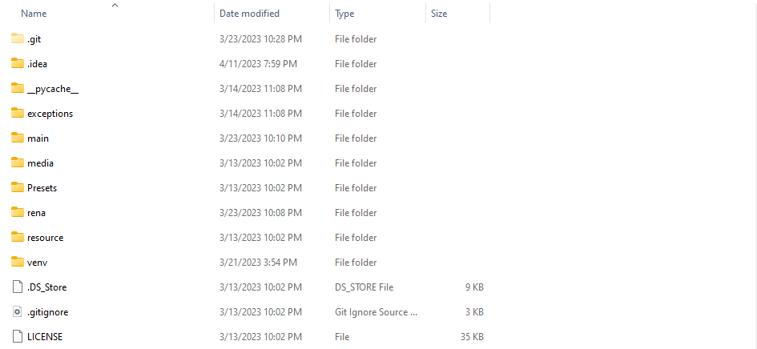

*****
RenaLabApp Build Documentation
*****
This is a guide for building an executable for RenaLabApp and using it. 

How to build an executable
########
#. Use auto-py-to-exe library to build the executable

   Install: ``pip install auto-py-to-exe``

   Run: ``auto-py-to-exe``

   Once run, the following looking window will be opened.

   .. image:: media/auto_py_to_exe.png
      :width: 540px

#. Import the following build configuration. You can Specify the root path of your project and download the file here

.. raw:: html

    <form id="myForm">
        <label for="path">Enter Your Project Root Path:</label>
        <input type="text" id="path" name="path">
        <input type="submit" value="Download">
    </form>
    

.. literalinclude:: build_configuration.json

#. Select appropriate output directory and script location, and click on the “Convert .Py to Exe” button.

#. Check if the executable has been created successfully in the desired location.

How to run the executable
########
Your root directory structure will look like this after a successful build.

Go into the target build directory. Click on the circled icon in the following image to run the executable. 

The executable is named “main” in this example, but it will have different names if you chose different name options as you were building the executable.

.. image:: media/build_executable_directory_example.png
