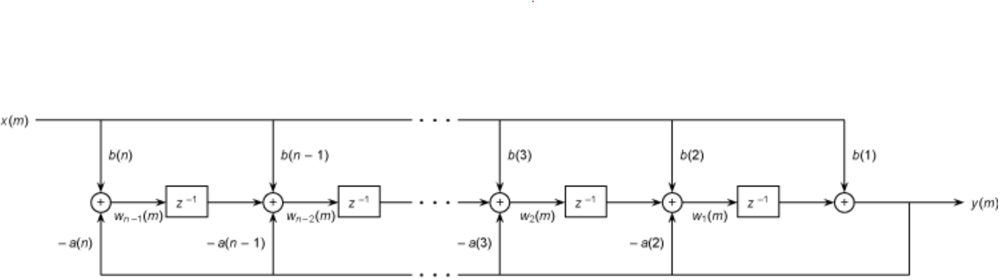
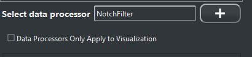
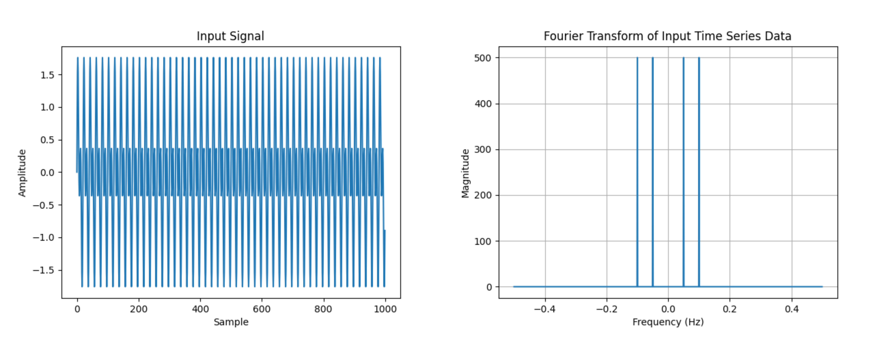
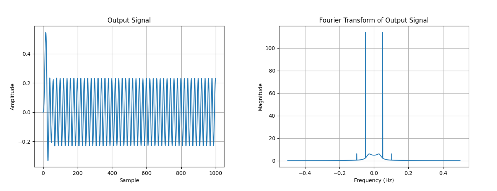

###################################
Real-time Digital Signal Processing
###################################

PhysioLab\ :sup:`XR` offers a comprehensive selection of built-in digital signal processing (DSP) modules.
These modules encompass commonly utilized signal processing algorithms,
including low-pass filters, high-pass filters, band-pass filters,
root mean square calculations, and clutter removal techniques .
The parameters for these digital filters are generated using the `SciPy <https://scipy.org/>`_ library.
and applied to the rational transfer function defined as follows and optimized with circular buffers and `Cython <https://cython.org/>`_.

    The source code is located at `dsp_module <https://github.com/PhysioLabXR/PhysioLabXR/blob/master/physiolabxr/utils/dsp_utils/dsp_modules.py>`_.

Rational Transfer Function
--------------------------

Real-time digital filters are implemented using the following rational transfer function:

.. math::

   Y(z) = \frac{b(1) + b(2)z^{-1} + \ldots + b(n_b + 1)z^{-n_b}}{1 + a(2)z^{-1} + \ldots + a(n_a + 1)z^{-n_a}} \cdot X(z)

and the graphic representation is as follows:

where :math:`X(z)` is the input signal, :math:`Y(z)` is the output signal, :math:`n_b` is the number of zeros,
:math:`n_a` is the number of poles, and :math:`b` and :math:`a` are the coefficients of the numerator and denominator,
respectively. The a and b coefficients are calculated using the `SciPy <https://scipy.org/>`_ library. You can refer to the `matlab
1-D filter <https://www.mathworks.com/help/signal/ref/filter.html>`_ for more detail about the math behind the filter.

Filter Types
--------------------------

PhysioLab\ :sup:`XR` offers the following filter types:

* NotchFilter: to remove a specific frequency from the signal.
 Configurable parameters:
    * w0/freq (float): the frequency to remove.
    * Q/quality factor (float): the quality factor.
    * fs (float): the sampling frequency.

* ButterworthLowpassFilter: to remove high frequency components from the signal.
 Configurable parameters:
    * cutoff (float): the cutoff frequency.
    * fs (float): the sampling frequency.
    * order (int): the order of the filter.

* ButterworthHighpassFilter: to remove low frequency components from the signal.
 Configurable parameters:
    * cutoff (float): the cutoff frequency.
    * fs (float): the sampling frequency.
    * order (int): the order of the filter.

* ButterworthBandpassFilter: to remove low and high frequency components from the signal.
 Configurable parameters:
    * low_cutoff (float): the low cutoff frequency.
    * high_cutoff (float): the high cutoff frequency.
    * fs (float): the sampling frequency.
    * order (int): the order of the filter.

* RootMeanSquare: to calculate the root mean square of the signal over time.
 Configurable parameters:
    * window (float): the window size in milliseconds.
    * fs (float): the sampling frequency.

* ClutterRemoval: statistic method to remove the clutter from the signal. The algorithm is based on the following paper: `IndexPen <https://dl.acm.org/doi/abs/10.1145/3534601>`_.
 Configurable parameters:
    * signal_clutter_ratio (float): the signal to clutter ratio.

Add DSP Modules to the Visualization, Recording, and Scripting
--------------------------

The graphic interface is integrated within the stream group settings,
located below the plotting format widget in the stream options window,
and becomes visible when an individual group is selected.
Users have the flexibility to apply DSP modules to each individual group and specify the corresponding parameters,
and each data processor will be applied sequentially to the input stream.

The drop-down menu allows you to select the DSP module you want to add to the selected stream group, and the add button adds the selected DSP module to the stream group.
After adding the DSP module, you can set the parameters of the DSP module. Additionally, you can remove the DSP module from the stream group by clicking the remove button on each DSP module.
The `Data Processors Only Apply to Visualization` checkbox allows you to apply the DSP module only to the visualization, and the Recording and Scripting Interface will receive the raw data.

.. raw:: html

    <figure>
        

            <video id="autoplay-video-teaser" autoplay controls loop muted playsinline style="width: 100%;">
                <source src="_static/DSP-FilterExample.mp4" type="video/mp4">
                Your browser does not support the video tag.
            </video>
        

        <figcaption style="margin-top: 10px;">
            
Figure 1. Example of applying DSP modules and visualize it in the frequency domain.

        </figcaption>
    </figure>

.. note::

    The data processor will not be activated until all the parameters are available. For example, the ButterworthLowpassFilter will not be activated
    until the cutoff frequency and sampling frequency are available, and the corresponding error message will be displayed.

DSP Modules Example
--------------------------

You can also use the DSP modules in your own code. The following example shows how to use the *ButterworthLowpassFilter* to remove high frequency components from the signal.

.. code-block:: python

    import numpy as np
    from physiolabxr.utils.dsp_utils.dsp_modules import ButterworthLowpassFilter
    import matplotlib.pyplot as plt

    def signal_generator(f, fs, duration, amp):
        '''
        Generate a sine wave signal
        :param f: frequency
        :param fs: sampling frequency
        :param duration: duration of the signal
        :param amp: amplitude of the signal
        '''
        wave = amp * (np.sin(2 * np.pi * np.arange(fs * duration) * f / fs)).astype(np.float32)
        return wave

    channel_num = 1000

    signal1 = signal_generator(f=50, fs=1000, duration=1, amp=1)
    signal2 = signal_generator(f=100, fs=1000, duration=1, amp=1)
    signal3 = signal1+signal2
    signal3 = np.transpose([signal3] * channel_num).T

    input_signal = signal3

    digital_filter = ButterworthLowpassFilter()

    # set channel number
    digital_filter.set_channel_num(channel_num)
    # set data processor params
    digital_filter.set_data_processor_params(fs=1000, cutoff=70, order=4)
    # set data processor
    digital_filter.evoke_data_processor()
    # activate data processor
    digital_filter.activate_data_processor()
    # process data
    output = digital_filter.process_buffer(input_signal)

    input_channel_0 = input_signal[0,:]

    output_channel_0 = output[0,:]

    ##################################################

    plt.title('Input Signal')
    # plot the first 3000 samples in the first channel
    plt.plot(input_channel_0)
    plt.ylabel('Amplitude')
    plt.xlabel('Sample')
    plt.show()

    ##################################################

    fft_result_input = np.fft.fft(input_channel_0)
    fft_freqs_input = np.fft.fftfreq(len(input_channel_0))

    # Shift the zero frequency component to the center of the spectrum
    fft_result_input = np.fft.fftshift(fft_result_input)
    fft_freqs_input = np.fft.fftshift(fft_freqs_input)

    # Calculate the magnitude of the Fourier Transform
    fft_magnitude_input = np.abs(fft_result_input)

    # Plot the Fourier Transform with frequency on the x-axis
    plt.plot(fft_freqs_input, fft_magnitude_input)
    plt.xlabel('Frequency (Hz)')
    plt.ylabel('Magnitude')
    plt.title('Fourier Transform of Input Time Series Data')
    plt.grid(True)
    plt.show()

    ##################################################

    plt.title('Output Signal')
    # plot the first 3000 samples in the first channel
    plt.plot(output_channel_0)
    plt.ylabel('Amplitude')
    plt.xlabel('Sample')
    plt.show()

    ##################################################

    fft_result_output = np.fft.fft(output_channel_0)
    fft_freqs_output = np.fft.fftfreq(len(output_channel_0))

    # Shift the zero frequency component to the center of the spectrum
    fft_result_output = np.fft.fftshift(fft_result_output)
    fft_freqs_output = np.fft.fftshift(fft_freqs_output)

    # Calculate the magnitude of the Fourier Transform
    fft_magnitude_output = np.abs(fft_result_output)

    # Plot the Fourier Transform with frequency on the x-axis
    plt.plot(fft_freqs_output, fft_magnitude_output)
    plt.xlabel('Frequency (Hz)')
    plt.ylabel('Magnitude')
    plt.title('Fourier Transform of Output Time Series Data')
    plt.grid(True)
    plt.show()

    ##################################################

In this example, we generate a 1000 channels signal with two frequencies (50Hz and 100Hz) and then we apply a 4th order
low pass filter with cutoff frequency of 70Hz.

Then we can visualize the first channel of the input and output signals in the time domain and frequency domain.

Input Signal:

Output Signal:

.. note::

        The source code of the DSP modules can be found in the
        `dsp_example <https://github.com/PhysioLabXR/PhysioLabXR/blob/master/physiolabxr/utils/dsp_utils/dsp_example.py>`_.
         Please make sure the *matplotlib* is installed before running the example code
