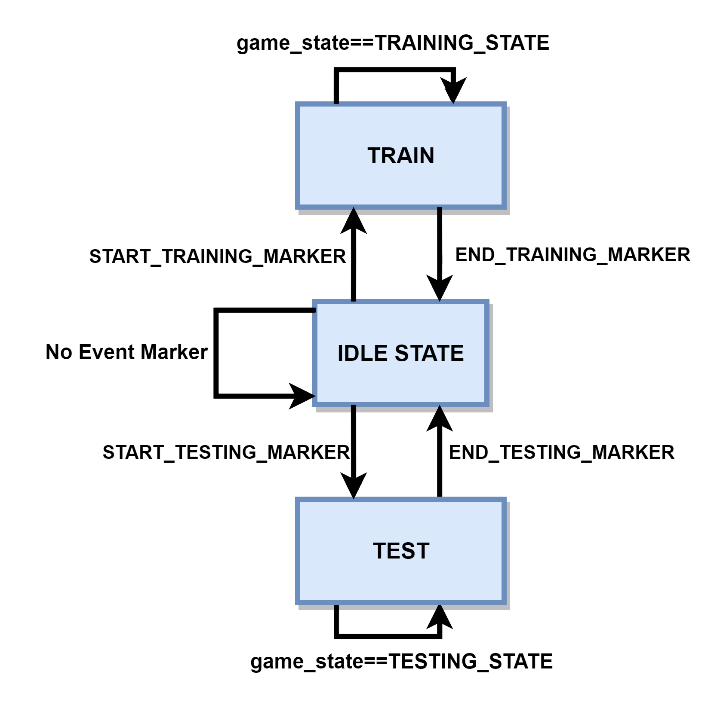
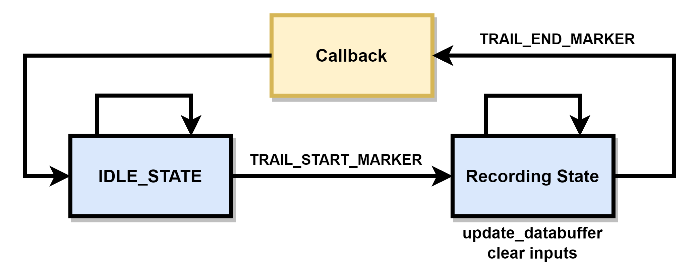
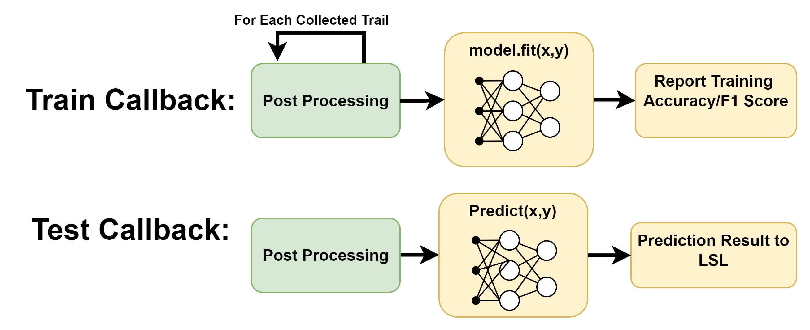
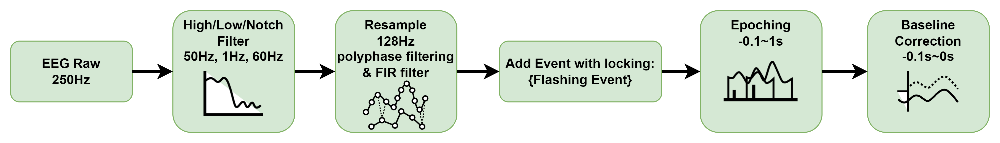

#############
PhysioLab\ :sup:`XR` + Unity P300 Speller Tutorial
#############

    Last Modified: 09/09/2023

.. contents:: Overview

*************
Introduction
*************

This tutorial will demonstrate how to use **PhysioLab\ :sup:`XR`** and **Unity** to implement a `P300 Speller <https://www.frontiersin.org/articles/10.3389/fnhum.2019.00261/full>`_
Brain Computer Interface (BCI) game.
The P300 Speller is a classic BCI game that uses the P300 Event-related potential (ERP) component to detect the user's intention.
The P300 is one of the most important Event-related potentials(ERP) components that is used to evaluate cognitive function, such as attention, working memory , and concentration.
In this tutorial we will use the **PhysioLab\ :sup:`XR`** as a real-time data acquisition platform and analysis tool, and use **Unity** as a stimulus presentation platform.

.. image:: media/PhysioLabXRP300SpellerDemo-IntroductionImage.png
    :width: 1080

*************
Unity Paradigm
*************

The Unity source code is available at: `pysiolabxr_p300speller_demo <https://github.com/HaowenWeiJohn/PysioLabXR_P300Speller_Demo.git>`_

.. note::
    The Unity Paradigm is developed using `Unity 2021.3.27f1 <https://unity3d.com/get-unity/download/archive>`_

This Unity paradigm implements a classic P300 Speller BCI game and researchers can use it for other testing purposes.
The user will first train the system by focusing on the target alphabet and the system will record the EEG data and the corresponding target alphabet in the Train mode.
After the training process, the user can use the system to spell words by focusing on the target alphabet in Test mode.

=======
Lab Streaming Layer (LSL) Configuration
=======
There is a 6 channel LSL stream from Unity Paradigm to RenaScript and the description for each channel is shown below:

P300 Speller Game Unity  LSL  Configuration:

    **LSL Outlet: "PhysioLabXRP300SpellerDemoPredictionProbability"**

        *Channel[0]: (StateEnterExitMarker)*
            Indicates the selected game states (Train/Test/Interrupt)
                - StartState: 1
                - TrainIntroductionState: 2
                - TrainState: 3
                - TestIntroductionState: 4
                - TestState: 5
                - EndState: 6

        *Channel[1]: (FlashBlockStartEndMarker)*
            Indicates the start and end of flashing for each trail
                - TrailStartMarker: 1

        *Channel[2]: (FlashingMarker)*
            The flash event marker. Send 1 while any column or row turns on
                - FlashingMarker: 1

        *Channel[3]: (FlashingItemIndexMarker)*
            Indicate the identity of the flashing component, range from 0 - 11
                - 0 - 5 indicates row 0 - 5
                - 7 - 11 indicates column 0 - 5

        *Channel[4]: (FlashingTargetMarker)*
            Indicate if the component is target or non-target during the training process. This channel is zero during the testing mode.
                - Target: 1

        *Channel[5]: (StateInterruptMarker)*
            The interrupt event marker. Send 1 while the user presses the interrupt button (Esc). The game will return to the start state after the interrupt.
                - InterruptMarker: 1

The Channel will be zero when the corresponding event is not happening,
while Channel[3] will be zero while the flashing component is the first row.
*Therefore, we have to check Channel[2] and Channel[3] at the same time to determine the identity of the flashing component!*

=======
State Diagram
=======

Train State
************
.. image:: media/PhysioLabXRP300SpellerDemo-TrainStateDiagram.png
    :width: 2560

Test State
************

.. image:: media/PhysioLabXRP300SpellerDemo-TestStateDiagram.png
    :width: 2560

Flash Block
***********
.. image:: media/PhysioLabXRP300SpellerDemo-FlashBlockBoardController.png
    :width: 900
The Flash Block is located in the Test State and Train State.

The source code for the training and testing process is located in the `BoardController.cs <https://github.com/HaowenWeiJohn/PysioLabXR_P300Speller_Demo/blob/main/Assets/Scripts/Others/BoardController.cs>`_ file.
The **TrainStateBoardCoroutine()** and **TestStateBoardCoroutine()** are the main functions for the training and testing process.
Those two **coroutines** will be started when the game enters the Train State and Test State.

*************
Rena Script: P300SpellerScript.py
*************

The RenaScript implemented a basic real-time training and testing pipeline for the P300 Speller game for Unity with a basic logistic regression.

=======
Lab Streaming Layer (LSL) Configuration
=======

There is a 2 channel LSL stream from RenaScript to Unity and the description for each channel is shown below:

P300 Speller Game RenaScript LSL Configuration:

    **LSL Outlet: "P300SpellerRenaScript"**

        *Channel0: (P300SpellerScriptPostProcessingDoneMarker)*
            Indicate the post processing has been done in RenaScript
                | FinishedTrainingMarker: 1
                | FinishedTestingMarker: 2

        *Channel1: (P300SpellerScriptPostProcessingInformationMarker)*
            Indicate the information from the post processing
                | TrainingAccuracy: The accuracy from the training (value range: 0 - 1)
                | PredictedCharacterIndex: The index+1 of the prediction result (value range: 1 - 30)

=======
State Diagram
=======

Overview
***********

Collect Data
***********

Callback Function
***********

Post Processing
***********

*************
Experiment
*************

This experiment implemented the P300 Speller Brain Computer Interface using RenaLabApp and a customized Unity Paradigm.
The similar setup can be extended to other human subject studies that include real time data acquisition and customized
experiment environment. The P300 is one of the most important Event-related potentials(ERP)
components that is used to evaluate cognitive function, such as attention, working memory , and concentration.
A peak occurs 300 ms after the expected event happened.

The Unity Paradigm hosts a six by five board that includes 26 alphabets, from A to Z,
as well as 4 instruction characters, including space, backspace, enter and activation. This input format adapts our previous publication IndexPen: Two-Finger Text Input with Millimeter-Wave Radar in which also used RenaLabApp for the entire user study.

During the training period, the user is instructed to focus on a particular letter(instructed in green),
and each roll and column will be flashed 15 times; therefore, there are 15 x 11 samples for each trail.
After the training mode, the user can go to the testing mode. Similarly, the user will focus on one character
during each trail, but without instruction. The predicted result will be typed in the text input box.

=======
Requirements
=======

    1. RenaLabApp
    2. Unity: https://github.com/HaowenWeiJohn/RenaLabApp-Unity-P300Speller
    3. Hardware: OpenBCI Cyton (8 Channels)
        Channel Selection: Fz, Cz, Pz, C3, C4, P3, P4, O1.

=======
Experiment Setup
=======

#. The first step is to set up the OpenBCI Cyton board. You can follow the instructions on https://docs.openbci.com/ . In our case we used Fz, Cz, Pz, C3, C4, P3, P4, O1. You can use OpenBCI GUI to check the signal quality before the experiment. To access the Cyton board stream, you can either create a customized script to get the data and export the data to LSL similar to the OpenBCIInterface.py example or use the supported device driver in RenaLabApp. Please check out the Hardware Support page for more information about supported devices in RenaLabApp.

#. Open the game through P300Speller.exe or Unity Editor.

#. Download and open the RenaLabApp.
#. Add the "P300Speller" event marker stream from P300 Speller game.
#. Add the OpenBCI stream from your customized script or serial driver in RenaLabApp.
#. Open Both streams. (You should see the play buttons turn green if the stream exists).
#. Add a new scripting widget in the RenaScript page.
#. Select the P300Script.py (TODO: file location) in your local computer.
#. Add both input streams in the scripting widget.
#. Change the buffer size and run times to a reasonable value. (We recommend 3 seconds for the buffer size and 5 for the run frequency.)
#. Click the Run button to run the script

=======
Run Experiment
=======

Practice
    He/She can practice the experiment in the Practice mode which does not interact with the RenaScript.

Train
    The first step is to collect some training data for the Logistic Regression model. The default training session asks the user to spell { "R"  "E" "N"  "A" }, and this can be modified in the options window.  The flashing pattern will be the same as the Practice Mode. After each trial, the Unity interface will wait for the training finish signal from RenaLabApp Script and the training accuracy will be shown on the screen. (The timeout duration will be 2 seconds by default).

Test
    After the training stage, he/she can test the trained model by clicking the test button. The test trial will run recursively until the user clicks the interrupt button.Unity will wait for the prediction result from RenaLabApp at the end of each trial, and the board will show the prediction result as well as the text input box on top. (The timeout duration will be 2 seconds by default, same as the training mode ).

*Run the experiment without OpenBCI device and Unity*
    We provide users with a recorded experiment that can be replayed while the user starts the replay.

