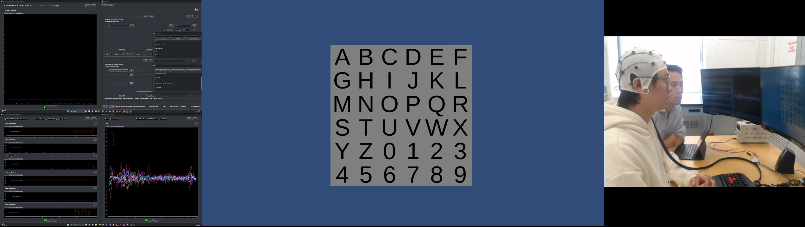
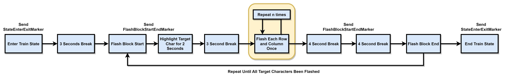
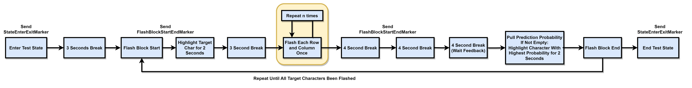
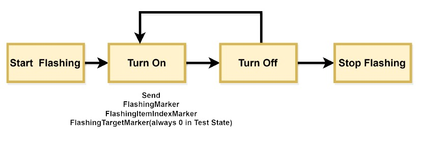

#############
PhysioLab\ :sup:`XR` + Unity P300 Speller Tutorial
#############

    Last Modified: 09/09/2023

.. contents:: Overview

*************
Introduction
*************

This tutorial will demonstrate how to use PhysioLab\ :sup:`XR` and Unity to implement a `P300 Speller <https://www.frontiersin.org/articles/10.3389/fnhum.2019.00261/full>`_
Brain Computer Interface (BCI) game.
The P300 Speller is a classic BCI game that uses the P300 Event-related potential (ERP) component to detect the user's intention.
The P300 is one of the most important Event-related potentials(ERP) components that is used to evaluate cognitive function, such as attention, working memory , and concentration.
In this tutorial we will use the PhysioLab\ :sup:`XR` as a real-time data acquisition platform and analysis tool, and use **Unity** as a stimulus presentation platform.

*************
Unity Paradigm
*************

The Unity source code is available at: `pysiolabxr_p300speller_demo <https://github.com/HaowenWeiJohn/PysioLabXR_P300Speller_Demo.git>`_

.. note::
    The Unity Paradigm is developed using `Unity 2021.3.27f1 <https://unity3d.com/get-unity/download/archive>`_

This Unity paradigm implements a classic P300 Speller BCI game and researchers can use it for other testing purposes.
The user will first train the system by focusing on the target alphabet and the system will record the EEG data and the corresponding target alphabet in the Train mode.
After the training process, the user can use the system to spell words by focusing on the target alphabet in Test mode.

=======
Lab Streaming Layer (LSL) Configuration
=======
There is a 6 channel LSL stream from Unity Paradigm to RenaScript and the description for each channel is shown below:

P300 Speller Game Unity  LSL  Configuration:

    **LSL Outlet: "PhysioLabXRP300SpellerDemoPredictionProbability"**

        *Channel[0]: (StateEnterExitMarker)*
            Indicates the selected game states (Train/Test/Interrupt)
                - StartStateEnter: 1, StartStateExit: -1
                - TrainIntroductionStateEnter: 2, TrainIntroductionStateExit: -2
                - TrainStateEnter: 3, TrainStateExit: -3
                - TestIntroductionStateEnter: 4, TestIntroductionStateExit: -4
                - TestStateEnter: 5, TestStateExit: -5
                - EndStateEnter: 6, EndStateExit: -6

        *Channel[1]: (FlashBlockStartEndMarker)*
            Indicates the start and end of flashing for each trail
                - FlashBlockStartMarker: 1, FlashBlockEndMarker: -1

        *Channel[2]: (FlashingMarker)*
            The flash event marker. Send 1 while any column or row turns on
                - FlashingMarker: 1

        *Channel[3]: (FlashingItemIndexMarker)*
            Indicate the identity of the flashing component, range from 0 - 11
                - 0 - 5 indicates row 0 - 5
                - 7 - 11 indicates column 0 - 5

        *Channel[4]: (FlashingTargetMarker)*
            Indicate if the component is target or non-target during the training process. This channel is zero during the testing mode.
                - Target: 1

        *Channel[5]: (StateInterruptMarker)*
            The interrupt event marker. Send 1 while the user presses the interrupt button (Esc). The game will return to the start state after the interrupt.
                - InterruptMarker: 1

The channel will be zero when the corresponding event is not happening,
while Channel[3] will be zero while the flashing component is the first row.

**Therefore, we have to check Channel[2] and Channel[3] at the same time to determine the identity of the flashing component!**

=======
State Diagram
=======

Train State
************

Test State
************

Flash Block
***********

The Flash Block is located in the Test State and Train State.

The source code for the training and testing process is located in the `BoardController.cs <https://github.com/HaowenWeiJohn/PysioLabXR_P300Speller_Demo/blob/main/Assets/Scripts/Others/BoardController.cs>`_ file.
The
`TrainStateBoardCoroutine() <https://github.com/HaowenWeiJohn/PysioLabXR_P300Speller_Demo/blob/963f997522d68d43198caec110388f1886419307/Assets/Scripts/Others/BoardController.cs#L123>`_
and
`TestStateBoardCoroutine() <https://github.com/HaowenWeiJohn/PysioLabXR_P300Speller_Demo/blob/963f997522d68d43198caec110388f1886419307/Assets/Scripts/Others/BoardController.cs#L203>`_
are the main functions for the training and testing process.

Those two **coroutines** will be started when the game enters the Train State and Test State.

*************
PhysioLab\ :sup:`XR` Scripting
*************

=======
Lab Streaming Layer (LSL) Configuration
=======

There is a 1 channel LSL stream from the PhysioLab\ :sup:`XR` to Unity to transfer the prediction probability for each charactor from the PhysioLab\ :sup:`XR` to Unity.

PhysioLab\ :sup:`XR` LSL Configuration:

    **LSL Outlet: "PhysioLabXRP300SpellerDemoPredictionProbability"**

        *Channel[0]-Channel[35]: (PredictionProbability)*
            The prediction probability for each charactor.
            The prediction probability is a 36 element array that contains the prediction probability for each charactor.

=======
Script: PhysioLabXRP300SpellerDemoScript.py and PhysioLabXR_P300SpellerDemoConfig.py
=======

The script can be found at: `PhysioLabXRP300SpellerDemoScript.py <https://github.com/PhysioLabXR/PhysioLabXR/blob/master/physiolabxr/scripting/Examples/PhysioLabXR_P300Speller_Demo/PhysioLabXRP300SpellerDemoScript.py>`_

    .. code-block:: python

        # This is a demo script for the PhysioLabXR P300 Speller Game

        import numpy as np
        from physiolabxr.scripting.RenaScript import RenaScript
        from physiolabxr.utils.buffers import DataBuffer
        from imblearn.over_sampling import SMOTE
        from sklearn.linear_model import LogisticRegression
        from sklearn.model_selection import train_test_split
        from sklearn.metrics import f1_score
        from sklearn import metrics

        # import the config file
        from physiolabxr.scripting.Examples.PhysioLabXR_P300Speller_Demo.PhysioLabXRP300SpellerDemoConfig import *

        # matplotlib and seaborn are not installed in PhysioLabXR by default, so we need to check if they are installed before importing them
        # If you want to use matplotlib and seaborn in your script, please install them in the PhysioLabXR environment following the instructions in the PhysioLabXR documentation
        Plot = True
        try:
            import seaborn as sns
            import matplotlib.pyplot as plt
        except:
            Plot = False
            print("Seaborn and Matplotlib not installed. Skip Plot.")

        class PhysioLabXRGameP300SpellerDemoScript(RenaScript):
            def __init__(self, *args, **kwargs):
                """
                Please do not edit this function
                """
                super().__init__(*args, **kwargs)
                # test network
                self.EXPERIMENT_STATE = ExperimentStateMarker.StartState
                self.IN_FLASHING_BLOCK = False
                self.model = LogisticRegression()
                self.data_buffer = DataBuffer()

                self.train_state_x = []
                self.train_state_y = []

                self.StateEnterExitMarker = 0
                self.FlashBlockStartEndMarker = 0
                self.FlashingMarker = 0
                self.FlashingItemIndexMarker = 0
                self.FlashingTargetMarker = 0
                self.StateInterruptMarker = 0

            # Start will be called once when the run button is hit.
            def init(self):
                print('Init function is called')
                pass

            # loop is called <Run Frequency> times per second
            def loop(self):
                # print('Loop function is called')
                if EEG_STREAM_NAME not in self.inputs.keys() or EVENT_MARKER_CHANNEL_NAME not in self.inputs.keys():
                    # if no event marker or no eeg stream, we do not do anything
                    print('No EEG stream or no event marker stream, return')
                    # state is None, and Flashing is False. We interrupt the experiment
                    self.EXPERIMENT_STATE = None
                    self.IN_FLASHING_BLOCK = False
                    return

                event_marker_data = self.inputs.get_data(EVENT_MARKER_CHANNEL_NAME)
                event_marker_timestamps = self.inputs.get_timestamps(EVENT_MARKER_CHANNEL_NAME)
                # print(event_marker_data)
                # in this example, we only care about the Train, Test, Interrupt, and Block Start/Block end markers
                # process event markers
                # try:
                for event_index, event_marker_timestamp in enumerate(event_marker_timestamps):
                    event_marker = event_marker_data[:, event_index]

                    self.StateEnterExitMarker = event_marker[EventMarkerChannelInfo.StateEnterExitMarker]
                    self.FlashBlockStartEndMarker = event_marker[EventMarkerChannelInfo.FlashBlockStartEndMarker]
                    self.FlashingMarker = event_marker[EventMarkerChannelInfo.FlashingMarker]
                    self.FlashingItemIndexMarker = event_marker[EventMarkerChannelInfo.FlashingItemIndexMarker]
                    self.FlashingTargetMarker = event_marker[EventMarkerChannelInfo.FlashingTargetMarker]
                    self.StateInterruptMarker = event_marker[EventMarkerChannelInfo.StateInterruptMarker]

                    if self.StateInterruptMarker:
                        # state is None, and Flashing is False. We interrupt the experiment
                        self.EXPERIMENT_STATE = None
                        self.IN_FLASHING_BLOCK = False

                    elif self.StateEnterExitMarker:
                        self.switch_state(self.StateEnterExitMarker)

                    elif self.FlashBlockStartEndMarker:
                        print('Block Start/End Marker: ', self.FlashBlockStartEndMarker)

                        if self.FlashBlockStartEndMarker == 1:  # flash start
                            self.IN_FLASHING_BLOCK = True
                            print('Start Flashing Block')
                            self.inputs.clear_up_to(event_marker_timestamp)
                            # self.data_buffer.update_buffers(self.inputs.buffer)
                        if self.FlashBlockStartEndMarker == -1:  # flash end
                            self.IN_FLASHING_BLOCK = False
                            print('End Flashing Block')
                            if self.EXPERIMENT_STATE == ExperimentStateMarker.TrainState:
                                # train callback
                                self.train_callback()
                                pass
                            elif self.EXPERIMENT_STATE == ExperimentStateMarker.TestState:
                                # test callback
                                self.test_callback()
                                pass
                    elif self.FlashingMarker:  # flashing
                        print('Flashing Marker: ', self.FlashingMarker)
                        print('Flashing Target Marker: ', self.FlashingTargetMarker)
                        print('Flashing Item Index Marker: ', self.FlashingItemIndexMarker)
                    else:
                        pass
                # except Exception as e:
                #     print(e)
                #     return

                # if flashing
                if self.IN_FLASHING_BLOCK:
                    # the event marker in the buffer only contains the event marker in the current flashing block
                    self.data_buffer.update_buffers(self.inputs.buffer)
                    # print('In Flashing Block, save data to buffer')

                self.inputs.clear_buffer_data()

            def switch_state(self, new_state):
                if new_state == ExperimentStateMarker.StartState:
                    print('Start State')
                    self.EXPERIMENT_STATE = ExperimentStateMarker.StartState

                elif new_state == ExperimentStateMarker.TrainIntroductionState:
                    print('Train Introduction State')
                    self.EXPERIMENT_STATE = ExperimentStateMarker.TrainIntroductionState

                elif new_state == ExperimentStateMarker.TrainState:
                    print('Train State')
                    self.EXPERIMENT_STATE = ExperimentStateMarker.TrainState

                elif new_state == ExperimentStateMarker.TestIntroductionState:
                    print('Test Introduction State')
                    self.EXPERIMENT_STATE = ExperimentStateMarker.TestIntroductionState

                elif new_state == ExperimentStateMarker.TestState:
                    print('Test State')
                    self.EXPERIMENT_STATE = ExperimentStateMarker.TestState

                elif new_state == ExperimentStateMarker.EndState:
                    print('End State')
                    self.EXPERIMENT_STATE = ExperimentStateMarker.EndState

                else:
                    print('Exit Current State: ', new_state)
                    self.EXPERIMENT_STATE = None

            def train_callback(self):
                # train callback

                flash_timestamps = self.data_buffer.get_timestamps(EVENT_MARKER_CHANNEL_NAME)
                eeg_timestamps = self.data_buffer.get_timestamps(EEG_STREAM_NAME)
                eeg_epoch_start_indices = np.searchsorted(eeg_timestamps, flash_timestamps, side='left')

                sample_before_epoch = np.floor(EEG_EPOCH_T_MIN * EEG_SAMPLING_RATE).astype(int)
                sample_after_epoch = np.floor(EEG_EPOCH_T_MAX * EEG_SAMPLING_RATE).astype(int)
                for eeg_epoch_start_index in eeg_epoch_start_indices:
                    eeg_epoch = self.data_buffer.get_data(EEG_STREAM_NAME)[:, eeg_epoch_start_index+sample_before_epoch:eeg_epoch_start_index+sample_after_epoch]
                    self.train_state_x.append(eeg_epoch)

                labels = self.data_buffer.get_data(EVENT_MARKER_CHANNEL_NAME)[EventMarkerChannelInfo.FlashingTargetMarker, :]
                self.train_state_y.extend(labels)

                # train based on all the data in the buffer
                x = np.array(self.train_state_x)
                y = np.array(self.train_state_y)
                print("Train On Data: ", x.shape, y.shape)
                train_logistic_regression(x, y, self.model, test_size=0.1)
                self.data_buffer.clear_buffer_data() # clear the buffer data for the next flashing block
                pass

            def test_callback(self):
                # test callback

                x = []

                flash_timestamps = self.data_buffer.get_timestamps(EVENT_MARKER_CHANNEL_NAME)
                eeg_timestamps = self.data_buffer.get_timestamps(EEG_STREAM_NAME)
                eeg_epoch_start_indices = np.searchsorted(eeg_timestamps, flash_timestamps, side='left')

                sample_before_epoch = np.floor(EEG_EPOCH_T_MIN * EEG_SAMPLING_RATE).astype(int)
                sample_after_epoch = np.floor(EEG_EPOCH_T_MAX * EEG_SAMPLING_RATE).astype(int)

                for eeg_epoch_start_index in eeg_epoch_start_indices:
                    eeg_epoch = self.data_buffer.get_data(EEG_STREAM_NAME)[:, eeg_epoch_start_index+sample_before_epoch:eeg_epoch_start_index+sample_after_epoch]
                    x.append(eeg_epoch)

                # predict based on all the data in the buffer
                x = np.array(x)
                x = x.reshape(x.shape[0], -1)
                y_target_probabilities = self.model.predict_proba(x)[:, 1]
                print(y_target_probabilities)
                flashing_item_indices = self.data_buffer.get_data(EVENT_MARKER_CHANNEL_NAME)[EventMarkerChannelInfo.FlashingItemIndexMarker, :]
                flashing_item_indices = np.array(flashing_item_indices).astype(int)
                probability_matrix = np.zeros(shape=np.array(Board).shape)
                for flashing_item_index, y_target_probability in zip(flashing_item_indices, y_target_probabilities):
                    if flashing_item_index<=5: # this is row index
                        row_index = flashing_item_index
                        probability_matrix[row_index, :] += y_target_probability
                    else: # this is column index, we need -6 to get the column index
                        column_index = flashing_item_index-6
                        probability_matrix[:, column_index] += y_target_probability

                # normalize the probability matrix to 0 to 1
                probability_matrix = probability_matrix / len(flashing_item_indices/24)

                self.set_output(PREDICTION_PROBABILITY_CHANNEL_NAME, probability_matrix.flatten())
                print("Prediction Probability Sent")

                self.data_buffer.clear_buffer_data()

                print(probability_matrix)

                # plot the probability matrix
                if Plot:
                    plt.imshow(probability_matrix, cmap='hot', interpolation='nearest')
                    plt.show()

            # cleanup is called when the stop button is hit
            def cleanup(self):
                self.model = None
                print('Cleanup function is called')

        def train_logistic_regression(X, y, model, test_size=0.2):
            """
            Trains a logistic regression model on the input data and prints the confusion matrix.

            Args:
                X (np.ndarray): Input features.
                y (np.ndarray): Target variable.
                model (LogisticRegression): An instance of LogisticRegression from scikit-learn.
                test_size (float): Proportion of the data to reserve for testing. Default is 0.2.

            Returns:
                None.

            Raises:
                TypeError: If model is not an instance of LogisticRegression.
                ValueError: If test_size is not between 0 and 1.

            """
            # Check if model is an instance of LogisticRegression
            if not isinstance(model, LogisticRegression):
                raise TypeError("model must be an instance of LogisticRegression.")

            # Check if test_size is between 0 and 1
            if test_size <= 0 or test_size >= 1:
                raise ValueError("test_size must be between 0 and 1.")

            # Split the data into training and testing sets
            x_train, x_test, y_train, y_test = train_test_split(X, y, stratify=y, test_size=test_size)
            rebalance_classes(x_train, y_train, by_channel=True)

            # Reshape the data. This is simple logistic regression, so we flatten the input x
            x_train = x_train.reshape(x_train.shape[0], -1)
            x_test = x_test.reshape(x_test.shape[0], -1)

            # Fit the model to the training data and make predictions on the test data
            model.fit(x_train, y_train)
            y_pred = model.predict(x_test)

            # plot the confusion matrix

            confusion_matrix(y_test, y_pred)

        def confusion_matrix(y_test: np.ndarray, y_pred: np.ndarray) -> None:
            """
            Plots a confusion matrix for the predicted vs. actual labels and prints the accuracy score.

            Args:
                y_test (np.ndarray): Actual labels of the test set.
                y_pred (np.ndarray): Predicted labels of the test set.

            Returns:
                None.

            Raises:
                TypeError: If either y_test or y_pred are not numpy arrays.

            """
            # Check if y_test and y_pred are numpy arrays
            if not isinstance(y_test, np.ndarray) or not isinstance(y_pred, np.ndarray):
                raise TypeError("y_test and y_pred must be numpy arrays.")

            # Calculate the confusion matrix and f1 score
            cm = metrics.confusion_matrix(y_test, y_pred)
            print("Confusion Matrix:")
            print(cm)
            score = f1_score(y_test, y_pred, average='macro')
            print("F1 Score (Macro): {:.2f}".format(score))

            if Plot:
                # Create a heatmap of the confusion matrix
                plt.figure(figsize=(9, 9))
                sns.heatmap(cm, annot=True, fmt=".3f", linewidths=.5, square=True, cmap='Blues_r')
                plt.ylabel('Actual label')
                plt.xlabel('Predicted label')
                all_sample_title = 'Accuracy Score: {0}'.format(score)
                plt.title(all_sample_title, size=15)
                plt.show()

        def rebalance_classes(x, y, by_channel=False):
            """
            Resamples the data to balance the classes using SMOTE algorithm.

            Parameters:
                x (np.ndarray): Input data array of shape (epochs, channels, samples).
                y (np.ndarray): Target labels array of shape (epochs,).
                by_channel (bool): If True, balance the classes separately for each channel. Otherwise,
                    balance the classes for the whole input data.

            Returns:
                tuple: A tuple containing the resampled input data and target labels as numpy arrays.
            """
            epoch_shape = x.shape[1:]

            if by_channel:
                y_resample = None
                channel_data = []
                channel_num = epoch_shape[0]

                # Loop through each channel and balance the classes separately
                for channel_index in range(0, channel_num):
                    sm = SMOTE(k_neighbors=5, random_state=42)
                    x_channel = x[:, channel_index, :]
                    x_channel, y_resample = sm.fit_resample(x_channel, y)
                    channel_data.append(x_channel)

                # Expand dimensions for each channel array and concatenate along the channel axis
                channel_data = [np.expand_dims(x, axis=1) for x in channel_data]
                x = np.concatenate([x for x in channel_data], axis=1)
                y = y_resample

            else:
                # Reshape the input data to 2D array and balance the classes
                x = np.reshape(x, newshape=(len(x), -1))
                sm = SMOTE(random_state=42)
                x, y = sm.fit_resample(x, y)

                # Reshape the input data back to its original shape
                x = np.reshape(x, newshape=(len(x),) + epoch_shape)

            return x, y

        # END CLASS

The configuration file can be found in
`PhysioLabXR_P300SpellerDemoConfig.py <https://github.com/PhysioLabXR/PhysioLabXR/blob/master/physiolabxr/scripting/Examples/PhysioLabXR_P300Speller_Demo/PhysioLabXRP300SpellerDemoConfig.py>`_.

    .. code-block:: python

        from enum import Enum

        import numpy as np

        # OpenBCI Stream Name
        EEG_STREAM_NAME = 'OpenBCICyton8Channels'
        EVENT_MARKER_CHANNEL_NAME = 'PhysioLabXRP300SpellerDemoEventMarker'
        PREDICTION_PROBABILITY_CHANNEL_NAME = "PhysioLabXRP300SpellerDemoPredictionProbability"

        # Sampling Rate
        EEG_SAMPLING_RATE = 250

        # eeg channel number
        EEG_CHANNEL_NUM = 8

        # epoch configuration
        EEG_EPOCH_T_MIN = -0.2
        EEG_EPOCH_T_MAX = 1.0

        # eeg channels from cython 8 board
        EEG_CHANNEL_NAMES = [
            "Fz",
            "Cz",
            "Pz",
            "C3",
            "C4",
            "P3",
            "P4",
            "O1"
        ]

        class IndexClass(int, Enum):
            pass

        class EventMarkerChannelInfo(IndexClass):
            StateEnterExitMarker = 0,
            FlashBlockStartEndMarker = 1,
            FlashingMarker = 2,
            FlashingItemIndexMarker = 3,  # the 0 - 5 is row, 7 - 11 is column
            FlashingTargetMarker = 4,
            StateInterruptMarker = 5,

        class ExperimentStateMarker(IndexClass):
            StartState = 1,
            TrainIntroductionState = 2,
            TrainState = 3,
            TestIntroductionState = 4,
            TestState = 5,
            EndState = 6,

            # # this is not included in the unity paradigm
            # IDLEState = 7

        ROW_FLASH_MARKER_LIST = [0, 1, 2, 3, 4, 5]
        COL_FLASH_MARKER_LIST = [7, 8, 9, 10, 11]
        Target_Flash_Marker = 1
        Non_Target_Flash_Marker = 0

        Board = [['A', 'B', 'C', 'D', 'E', 'F'],
                 ['G', 'H', 'I', 'J', 'K', 'L'],
                 ['M', 'N', 'O', 'P', 'Q', 'R'],
                 ['S', 'T', 'U', 'V', 'W', 'X'],
                 ['Y', 'Z', '0', '1', '2', '3'],
                 ['4', '5', '6', '7', '8', '9']]

The configuration file is located in the same directory with the script file, and all the configurations
should be imported into the script file. The configuration file includes the following configurations:

    * **EEG_STREAM_NAME**: The name of the EEG stream.
    * **EVENT_MARKER_CHANNEL_NAME**: The name of the event marker channel.
    * **PREDICTION_PROBABILITY_CHANNEL_NAME**: The name of the prediction probability channel.
    * **EEG_SAMPLING_RATE**: The sampling rate of the EEG stream.
    * **EEG_CHANNEL_NUM**: The number of EEG channels.
    * **EEG_EPOCH_T_MIN**: The minimum time of the epoch.
    * **EEG_EPOCH_T_MAX**: The maximum time of the epoch.
    * **EEG_CHANNEL_NAMES**: The names of the EEG channels.
    * **EventMarkerChannelInfo**: The class that defines the event marker channel information.
    * **ExperimentStateMarker**: The class that defines the experiment state marker.
    * **ROW_FLASH_MARKER_LIST**: The list of the row flash marker.
    * **COL_FLASH_MARKER_LIST**: The list of the column flash marker.
    * **Target_Flash_Marker**: The target flash marker.
    * **Non_Target_Flash_Marker**: The non-target flash marker.
    * **Board**: The board of the P300 speller.

*************
Experiment
*************

This experiment implemented the P300 Speller Brain Computer Interface using RenaLabApp and a customized Unity Paradigm.
The similar setup can be extended to other human subject studies that include real time data acquisition and customized
experiment environment. The P300 is one of the most important Event-related potentials(ERP)
components that is used to evaluate cognitive function, such as attention, working memory , and concentration.
A peak occurs 300 ms after the expected event happened.

The Unity Paradigm hosts a six by five board that includes 26 alphabets, from A to Z, and 10 numbers, from 0 to 9.

During the training period, the user is instructed to focus on a particular letter(instructed in green),
and each roll and column will be flashed n times; therefore, there are n x 12 samples for flash block.
After the training mode, the user can go to the testing mode. Similarly, the user will focus on one character
during each trail, but without instruction. The predicted result will be typed in the text input box.

=======
Requirements
=======

1. PhysioLab\ :sup:`XR`: `physiolabxr <https://github.com/PhysioLabXR/PhysioLabXR/tree/master>`_
2. Unity project download from: `pysiolabxr_p300speller_demo <https://github.com/HaowenWeiJohn/PysioLabXR_P300Speller_Demo.git>`_
3. OpenBCI: `Cyton-8-Channel <https://shop.openbci.com/collections/frontpage/products/cyton-biosensing-board-8-channel?variant=38958638540>`_
    Channel Selection: Fz, Cz, Pz, C3, C4, P3, P4, O1.

=======
Experiment Setup
=======

In this experiment, all the required scripts are included in your local directory: *physiolabxr/scripting/Examples/PhysioLabXR_P300Speller_Demo*,
and can also be found in the `pysiolabxr_p300speller_demo <https://github.com/PhysioLabXR/PhysioLabXR/tree/master/physiolabxr/scripting/Examples/PhysioLabXR_P300Speller_Demo>`_.

Get the OpenBCI Cyton-8-Channel board and connect it to the computer.
************

For this step, please refer to: `OpenBCI Cyton Getting Started Guide <https://docs.openbci.com/GettingStarted/Boards/CytonGS/>`_.
It is very important to complete the `FTDI Driver Installation <https://docs.openbci.com/Troubleshooting/FTDI_Fix_Windows/>`_ before starting the experiment.
The Latency timer should be set to 1 ms (the default value is 16 ms) to reduce the latency.

Check EEG Signal Quality
************

You can use the OpenBCI GUI to check the EEG signal quality. Same as the previous step, please refer to `OpenBCI Cyton Getting Started Guide <https://docs.openbci.com/GettingStarted/Boards/CytonGS/>`_ to use OpenBCI GUI to check the impedance of each channel.

Start the OpenBCI Cyton-8-Channel board from PhysioLab\ :sup:`XR` Scripting Interface using PhysioLabXROpenBCICyton8ChannelsScript.py
************

The script can be downloaded from `PhysioLabXROpenBCICyton8ChannelsScript.py <https://github.com/PhysioLabXR/PhysioLabXR/blob/master/physiolabxr/scripting/Examples/PhysioLabXR_P300Speller_Demo/PhysioLabXROpenBCICyton8ChannelsScript.py>`_.

    .. code-block:: python

        # This is an example script for PhysioLabXR. It is a simple script that reads data from OpenBCI Cyton 8 Channels and sends it to Lab Streaming Layer.
        # The output stream name is "OpenBCICyton8Channels"

        import time

        import brainflow
        import pylsl
        from brainflow.board_shim import BoardShim, BrainFlowInputParams

        from physiolabxr.scripting.RenaScript import RenaScript

        class PhysioLabXROpenBCICyton8ChannelsScript(RenaScript):
            def __init__(self, *args, **kwargs):
                """
                Please do not edit this function
                """
                super().__init__(*args, **kwargs)

            # Start will be called once when the run button is hit.
            def init(self):
                # check if the parameters are set

                if "serial_port" not in self.params: # check
                    while True:
                        print("serial_port is not set. Please set it in the parameters tab (e.g. COM3)")
                        time.sleep(1)
                else:
                    if type(self.params["serial_port"]) is not str:
                        while True:
                            print("serial_port should be a string (e.g. COM3)")
                            time.sleep(1)

                print("serial_port: ", self.params["serial_port"])

                # try init board
                self.brinflow_input_params = BrainFlowInputParams()

                # assign serial port from params to brainflow input params
                self.brinflow_input_params.serial_port = self.params["serial_port"]

                self.brinflow_input_params.ip_port = 0
                self.brinflow_input_params.mac_address = ''
                self.brinflow_input_params.other_info = ''
                self.brinflow_input_params.serial_number = ''
                self.brinflow_input_params.ip_address = ''
                self.brinflow_input_params.ip_protocol = 0
                self.brinflow_input_params.timeout = 0
                self.brinflow_input_params.file = ''

                # set board id to Cyton 8-channel (0)
                self.board_id = 0 # Cyton 8-channel

                try:
                    self.board = BoardShim(self.board_id, self.brinflow_input_params)
                    self.board.prepare_session()
                    self.board.start_stream(45000, '') # 45000 is the default and recommended ring buffer size
                    print("OpenBCI Cyton 8 Channels. Sensor Start.")
                except brainflow.board_shim.BrainFlowError:
                    while True:
                        print('Board is not ready. Start Fild. Please check the serial port and try again.')
                        time.sleep(1)

            # loop is called <Run Frequency> times per second
            def loop(self):
                timestamp_channel = self.board.get_timestamp_channel(0)
                eeg_channels = self.board.get_eeg_channels(0)
                # print(timestamp_channel)
                # print(eeg_channels)

                data = self.board.get_board_data()

                timestamps = data[timestamp_channel]
                data = data[eeg_channels]

                absolute_time_to_lsl_time_offset = time.time() - pylsl.local_clock()
                timestamps = timestamps - absolute_time_to_lsl_time_offset # remove the offset between lsl clock and absolute time
                self.set_output(stream_name="OpenBCICyton8Channels", data=data, timestamp=timestamps)

            # cleanup is called when the stop button is hit
            def cleanup(self):
                print('Stop OpenBCI Cyton 8 Channels. Sensor Stop.')

1. Go to the `Script Tab <Scripting.html>`_ and click the *Add* button to start the script. You can either create a new script and replace the content provided above, or select *PhysioLabXROpenBCICyton8ChannelsScript.py* located in the *physiolabxr/scripting/Examples/PhysioLabXR_P300Speller_Demo* directory. After adding the script, you will need to add the output stream in the *Output Widget* and parameters in the *Parameters Widget*.

2. Type the output stream name: *OpenBCICyton8Channels* in the *Output Widget* and click the *Add* button.

3. Keep the output type as *LSL* and *float32* and change the output channel number in the line edit to *8*. (We have 8 EEG channels in this experiment)

4. Type the parameter name: *serial_port* in the **Parameter Widget** and click the *Add* button.

5. Change the parameter type to *str* and type the serial port name in the line edit. (e.g. COM3) You can find this information in your device manager.

6. Below the text box with the path to your script, change the *Run Frequency (times per seconds)* to *>=40* Hz. (Higher frequency is recommended to reduce the latency, but the execution time for each loop also should be considered.)

7. Click the *Run* button to start the script.

8. Go to the **Stream Tab** and type *OpenBCICyton8Channels* in *Add Widget* and the *Start Button* should be enabled already. Click the *Start Button* to start the stream.

9. Follow the instruction in `DSP <DSP.html>`_ to add filters to the stream. We need a Notch Filter with *60 Hz* target frequency and a Butterworth Bandpass Filter with *0.5 Hz* low cutoff frequency and *50 Hz* high cutoff frequency to the stream.

Start Unity
************

1. Download the Unity project from the `PhysioLabXR_P300Speller_Demo <https://github.com/HaowenWeiJohn/PysioLabXR_P300Speller_Demo>`_ repository.

2. Start the Game by clicking the *Play* button in the Unity Editor. This will initiate the **PhysioLabXRP300SpellerDemoEventMarker** on Network. (You can also build the project and run the executable file.)

3. Go to **Stream Tab**. Type **PhysioLabXRP300SpellerDemoEventMarker** in the *Add Widget* and click the *Start Button* to start the stream.

Add PysioLabP300SpellerDemoScript.py
************

1. Go to the `Script Tab <Scripting.html>`_ and click the *Add* button to start the script. You can either create a new script and replace with *PhysioLabXRP300SpellerDemoScript.py* we mentioned above, or select *PhysioLabP300SpellerDemoScript.py* located in the *physiolabxr/scripting/Examples/PhysioLabXR_P300Speller_Demo* directory.

2. We need to add the Event Marker stream and EEG Stream as an input to the script. Type the stream name: *OpenBCICyton8Channels* in the *Input Widget* and click the *Add* button. Repeat this step for the *PhysioLabXRP300SpellerDemoEventMarker* stream.

3. Type the parameter name *PhysioLabXRP300SpellerDemoPredictionProbability* in the *Outputs Widget* and click the *Add* button. Keep the output type as *LSL* and *float32* and change the output channel number in the line edit to *36*. Each channel represents the probability of one character, and we have 36 characters in total. (A-Z, 0-9)

4. Below the text box with the path to your script, change the *Run Frequency (times per seconds)* to *>=20* Hz. (Higher frequency is recommended to reduce the latency, but the execution time for each loop also should be considered.)

5. Click the *Run* button to start the script.

6. Now you can add the *PhysioLabXRP300SpellerDemoPredictionProbability* stream in the **Stream Tab** and click the *Start Button* to start the stream.

====================
Experiment
====================

At this point, we have two scripts running in the **Script Tab**

1. *PysioLabP300SpellerDemoScript.py*: This script receives the *OpenBCICyton8Channels* stream from the OpenBCI Cyton 8 Channels and *PhysioLabXRP300SpellerDemoEventMarker* stream from the Unity platform. It also sends the *PhysioLabXRP300SpellerDemoPredictionProbability* stream to the Unity platform and *Stream Tab* just for visualization purpose.

2. *PhysioLabXROpenBCICyton8ChannelsScript.py*: This script connect the OpenBCI Cyton 8 Channels via `brainflow <https://brainflow.readthedocs.io/en/stable/>`_ and send the *OpenBCICyton8Channels* stream to the local network through LSL.

Three Streams are running in the **Stream Tab**:

1. *OpenBCICyton8Channels*: This stream is sent from *PysioLabP300SpellerDemoScript.py*. Indicate the EEG data from the OpenBCI Cyton 8 Channels.

2. *PhysioLabXRP300SpellerDemoEventMarker*: This stream is from the Unity platform. Indicate the event marker for the P300 Speller.

3. *PhysioLabXRP300SpellerDemoPredictionProbability*: This stream is sent from the *PysioLabP300SpellerDemoScript.py* for visualization purpose. Indicate the prediction probability for each character in testing process.

Run the Experiment
************

1. The game start with a *Start State*. The participant can go to the next state by pressing the *Space* key.

2. The participant will enter the *TrainIntroduction State* and user must fill the parameters before the *Train State*.
    Configurable Parameters:
        - Train Chars: The characters that will be used in the training process. (e.g. ABCDEFGHIJKLMNOPQRSTUVWXYZ0123456789)
        - Repeat Times: The number of times to flash each column and row (e.g. 10)
        - Flash Interval: The interval between each flash in the training and testing process. (e.g. 0.1)
        - Flash Duration: The duration of each flash in the training and testing process. (e.g. 0.1)

.. note::
    The same setting will be applied to both training and testing process, except the *Train Chars* parameter. The *Train Chars* parameter will only be used in the training process.

3. After filling the parameters, the participant can press the *Space* key to start the training process. The participant will enter the *Train State* and the training process will start. The participant has to focus on the highlighted character at the beginning of each flash block.

4. After the training process, the the user will enter the *TestIntroduction State*. At this point, a logistic regression is trained based on the training data and the user can press the *Space* key to start the testing process.

5. During the testing process, the participant can chose any character by focusing on that character during the flash block. The character with the highest probability will be selected as the prediction. The participant can press the *Space* key to exit the testing process and go to the *End State*.

.. note::
    The participant can press the *Escape* key to exit the game at any time. This will return the participant to the *Start State*.

