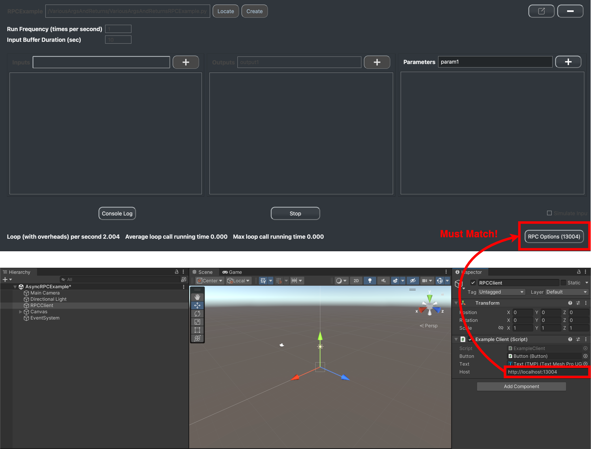

.. _feature rpc-unity:

#############################################################
RPC with C# (Unity)
#############################################################

Using RPC in Unity is very helpful when you have a experiment paradigm build in Unity and you want to run real-time
data analysis in PhysioLab\ :sup:`XR`.

Setup
=====

To use RPC with C#, PhysioLab\ :sup:`XR` needs **the grpc plugin** to compile protobuf into C# code. Additionally, you need the grpc
packages in Unity to use the generated C# code. This section will guide you through the setup process.

Install dotnet SDK on MacOS
----------------------------

On MacOS, part of the installation (i.e., homebrew) requires admin privileges. So PhysioLab\ :sup:`XR` will not
be able to install the dotnet-sdk automatically.

Please follow these steps to install the dotnet-sdk manually:

1. You will need to install home brew, a package manager for MacOS, following `the instructions here <https://brew.sh/>`_.
2. Once home brew is install, install the dotnet-sdk using this command:

.. code-block:: bash

    brew install --cask dotnet-sdk

3. Once the dotnet-sdk is installed, restart PhysioLab\ :sup:`XR` and it should automatically install and configure the grpc plugin.

Install dotnet SDK on Windows
------------------------------

The setup for Windows involve install `dotnet SDK <https://learn.microsoft.com/en-us/dotnet/core/install/windows?tabs=net80>`_ via `winget`.
The process is handled automatically by PhysioLab\ :sup:`XR` when it starts. Should you run into any problems, please
refer to the :ref:`troubleshooting page <troubleshooting>`.

Set GRPC dependencies in Unity
------------------------------

On the Unity side, you can setup the grpc dependencies using one of the following methods.

Method 1: Using the Unity-PhysiolabXR-Package
++++++++++++++++++++++++++++++++++++++++++++++

In the Unity Editor, open the Package Manager, click on the `+s` button and select `Add package from git URL <https://docs.unity3d.com/Manual/upm-git.html>`_.
Add the following URL to the package manager:

.. code-block:: bash

    https://github.com/PhysioLabXR/Unity-PhysioLabXR-Package.git

PhysioLabXR's Unity Package has more than just the grpc package. Read more about it :ref:`here <LSLZMQUnityPackage>`.

Method 2: Manually installing the packages
++++++++++++++++++++++++++++++++++++++++++++++

Alternatively, you can manually install the grpc package and all its dependencies.
We also need a third-party HTTP2 handler because Unity's built-in HTTP handler does not support HTTP2.

To install the grpc package:

1. In your Unity project, install `NuGetForUnity <https://github.com/GlitchEnzo/NuGetForUnity>`_, a package manager for NuGet packages in Unity.
2. Install the following NuGet packages:

    - Grpc.Net.Client
    - Google.Protobuf

To install the HTTP2 handler, follow `the instructions here <https://github.com/Cysharp/YetAnotherHttpHandler?tab=readme-ov-file#installation>`_.

Start Using RPC in Unity
==========================

If you installed the package with the `Unity-PhysiolabXR-Package <https://github.com/PhysioLabXR/Unity-PhysioLabXR-Package.git>`_,
you can import the samples from the package. In Unity's package manager, you can find the samples if you select the PhysioLabXR package and click on the `Samples` tab.

The GRPC example include a sample scene with a script named `ExampleClient.cs` that shows how to communicate from the Unity client to the
server in PhysioLab\ :sup:`XR`.

The sample PhyScript that contains the server code is named `VariousArgsAndReturnsRPCExample.py`.
You can find the example `here <https://github.com/PhysioLabXR/PhysioLabXR-Community/blob/rpc/physiolabxr/examples/rpc/VariousArgsAndReturns/VariousArgsAndReturnsRPCExample.py>`_.

Here's a video that shows how to run the example. It includes the following steps.

.. raw:: html

    

        <video id="autoplay-video1" autoplay controls loop muted playsinline style="position: absolute; top: 0; left: 0; width: 100%; height: 100%;">
            <source src="../_static/grpc-unity.mp4" type="video/mp4">
            Your browser does not support the video tag.
        </video>
    

The time in the brackets indicates the time in the video when the step is shown:

1. (0:00) Add the `PhysioLabXR package <https://github.com/PhysioLabXR/Unity-PhysioLabXR-Package.git>`_ into Unity.
2. (0:22) Import the GRPC samples from the package into the Unity assets, and opens the sample scene.
3. (0:42) Load the PhyScript `VariousArgsAndReturnsRPCExample.py <https://github.com/PhysioLabXR/PhysioLabXR-Community/blob/rpc/physiolabxr/examples/rpc/VariousArgsAndReturns/VariousArgsAndReturnsRPCExample.py>`_ in PhysioLab\ :sup:`XR`.
4. (1:01) Set the output path of the C# protobuf files to *where the Unity project is*.
5. (1:15) Start the PhyScript to compile and start the RPC server.
6. (1:31) Start the Play Mode in Unity to call the server from the client by pressing the `Press Me` button.

.. note::

        Before you enter Play Mode in step 6, you may need to adjust the port number in Unity to match that of the server.
        In the GameObject "RPCClient", you can find the `ExampleClient.cs` script. In the script, you must change the "Host"
        to match the server's port number. PhysioLab\ :sup:`XR` uses the localhost by default, meaning the server and client
        are on the same machine. In this case, the port number on the Unity side should be `http://localhost:<port number>`.
        See example below:

