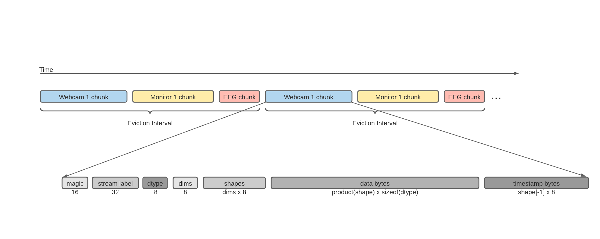

###############
Recording Data
###############

PhysioLab\ :sup:`XR`'s recording interface lets you record multi-stream data with synchronized timestamps from various
sources, for example, EEG and screen capturing from your experiment.

Supported File Formats
***********************

The platform supports various data formats to best fit your donwstream pipeline:

- *.dats* (dictionary of array and timestamps): PhysioLabXR's native data format, which is a binary format that stores data
  in a compact way. This format is
  optimized for quick serialization during a recording session. It can take a while to load back. If you will use Python
  for downstream analysis, we recommend using the pickle format instead.
- *.p* (`pickle <https://docs.python.org/3/library/pickle.html>`_): Python's native data format. This format is optimized
  for quick serialization and deserialization. It is recommended if you will use Python for downstream analysis.
- *.m* (`MATLAB <https://www.mathworks.com/help/matlab/import_export/mat-file-versions.html>`_): MATLAB's native data format.
  It is recommended if you will use MATLAB for downstream analysis.
- *.csv* (`comma-separated values <https://en.wikipedia.org/wiki/Comma-separated_values>`_): A text-based data format. Not
  best for saving a large amount of data, but it is human-readable and can be easily imported to other software.
- *.xdf* (`Extensible Data Format <https://github.com/sccn/xdf>`_): A data format often
  used for physiological data, compatible with many software packages and analysis tools.

What is saved
*************

Regardless of the data format, for all streams, PhysioLab\ :sup:`XR` saves data by each frame and the time when it captured
that frame. When loaded
back, if you are in *Python*,
the data is returned as **a dictionary of arrays and timestamps**. The keys of the dictionary are the stream names. The values
are a tuple of (data, timestamps). If you are in MATLAB, the data is returned as a struct with the same fields.

Learn From a Simple Example How to Record Data
*******************************************************
In this example, we will record two data streams: a randomly generated stream and screen capturing.

Create a Dummy Stream
--------------------------------
First, make sure you have the following packages installed in your Python environment:

- pylsl
- numpy

You can install them with ``pip install pylsl numpy``, or if you use a conda environment, you can install them with
``conda install -c conda-forge pylsl numpy``.

We will create a dummy stream to record. Create a new python file, put in the following snippet.

.. literalinclude:: LSLExampleOutlet.py
    :language: python
    :linenos:
    :lines: 1-100

Now run the script in your terminal with a command like ``python LSLExampleOutlet.py``. The script will start an LSL
stream with stream name 'Dummy-8Chan' and stream type 'EEG'. The stream will generate random data with 8 channels and
a sampling rate of 250 Hz. The stream will keep running until you stop the script.

Add the streams to be recorded
--------------------------------

.. |ico0| image:: /media/stream_tab.png
   :height: 3ex

.. |ico1| image:: /media/start_button.png
   :height: 3ex

.. |ico2| image:: /media/Recording_Tab.png
   :height: 3ex

.. |ico3| image:: /media/recording_option.png
   :height: 3.5ex

.. |ico4| image:: /media/start_recording.png
   :height: 3ex

.. |ico5| image:: /media/stop_recording.png
   :height: 3ex

.. |ico6| image:: /media/start.svg
   :width: 20px
   :height: 20px

1. In the main window, navigate to the ``stream tab`` located in the main window. In the **Add Stream** widget,
type in 'Dummy-8Chan', the name of the stream we created in the previous step. Press the **Add** button or
press **Enter** on your keyboard to add the stream.

2. We will add an video stream capturing your computer's display.
Now create a new stream by starting to type 'monitor 0'. PhysioLab\ :sup:`XR` uses this name for screen capturing.
The current version only supports capturing the main display if multiple displays are in use.

.. raw:: html

    

        <video id="autoplay-video1" autoplay controls loop muted playsinline style="position: absolute; top: 0; left: 0; width: 100%; height: 100%;">
            <source src="_static/Recording1.mp4" type="video/mp4">
            Your browser does not support the video tag.
        </video>
    

.. note::

    This setup, a physiological stream and a screen capturing stream is a good example of what needs to be recorded in
    a typical experiment. You can add more streams if you have more data sources.

2. In the same tab, you should see two stream widgets now 'Dummy-8Chan' and 'monitor 0'
with some information about the streams. There's no start/stop button for the screen capturing because it's always on.
You should see a :cyan:`cyan` bubble at the bottom of the 'Dummy-8Chan' widget, meaning this stream is available on the
network. Press the |ico6| button under 'Dummy-8Chan' stream to start receive
the stream.

.. note::

    If the bubble is :red:`red`, it means the stream is not available on the network. Make sure the dummy
    stream is running by
    checking the steps in the previous section `Create a Dummy Stream <Recording.html#create-a-dummy-stream>`_.

.. raw:: html

    

        <video id="autoplay-video1" autoplay controls loop muted playsinline style="position: absolute; top: 0; left: 0; width: 100%; height: 100%;">
            <source src="_static/Recording2.mp4" type="video/mp4">
            Your browser does not support the video tag.
        </video>
    

Record the data
--------------------------------

3. Now navigate to the ``recording tab`` located on the upper left corner in the main window.
(Optional) In the recording tab, click the ``recording options`` button,
you can modify the directory to which you want to store your data and the file format you want to store your data in.

.. raw:: html

    

        <video id="autoplay-video1" autoplay controls loop muted playsinline style="position: absolute; top: 0; left: 0; width: 100%; height: 100%;">
            <source src="_static/Recording3.mp4" type="video/mp4">
            Your browser does not support the video tag.
        </video>
    

4. Click ``Start recording`` button, the app will start recording the streams. At the bottom right corner,
you can see the recording
duration and file size as they increase.

5. Click ``Stop Recording`` button, the app will stop recording and store the recorded data to the path you specified.

.. raw:: html

    

        <video id="autoplay-video1" autoplay controls loop muted playsinline style="position: absolute; top: 0; left: 0; width: 100%; height: 100%;">
            <source src="_static/Recording45.mp4" type="video/mp4">
            Your browser does not support the video tag.
        </video>
    

.. note::
    Loading .p, .xdf, and .mat are faster than .dats and .csv files. Recording video as .csv files are not recommended, as it takes a long time and the recorded file can be very large. See `Supported File Formats <Recording.html#supported-file-formats>`_ for more details.

6. Now you can open the recording directory (you can open it from the context menu
   **file**/**Show Recordings**) to see the recorded file.

.. raw:: html

    

        <video id="autoplay-video1" autoplay controls loop muted playsinline style="position: absolute; top: 0; left: 0; width: 100%; height: 100%;">
            <source src="_static/Recording6.mp4" type="video/mp4">
            Your browser does not support the video tag.
        </video>
    

If you are using recorded file
--------------------------------

You can use the load functions from PhysioLab\ :sup:`XR`, first install the pip package ``pip install PhysioLabXR``

And simply import the load function, here is an example
.. code-block:: python

    from physiolabxr.utils.user_utils import stream_in

    data = stream_in('path/to/dats/file')

Advanced
****************

.dats serialization and eviction interval
------------------------------------------
The recording is enabled by a serialization interface (RNStream) optimized for data with timestamps from multiple
sources (i.e., EEG, eyetracking and video recorded simultaneously)

Recording files is created by RealityNavigation uses .dats file format. .dats (dictionary of array and timestamps) is a binary file format used by RealityNavitaion to log the recorded data.
The structure of .dats is shown in the figure below

The file content is first segmented by eviction intervals. Within each interval, each type-length-
value (TLV) packet contains the data for individual streams. The figure shows the anatomy of a TLV packet. Starting with a delimiter sequence
called magic, the packet contains the data array and timestamps preceded by meta information: stream name, data type, number of dimensions, and
the shape of the data. When loading .dats back, the loader uses the dimension information to determine the number of bytes to read as data and
timestamp

Once recording starts, all the data streams are routed to a specialized buffer.
The buffer’s content is retained in the host’s memory until the eviction interval is hit. Default at one second, the
eviction interval controls how often we offload the buffer to the disk. When the data throughput are high, it is important
to evict the buffer in time to prevent out-of-memory. User may adjust the eviction interval in the settings to optimize
for their use case. During an eviction, each stream’s data and timestamps is appended to the file as a TLV packet

Developer
#########

`Go To Developer Page <Developer.html>`_