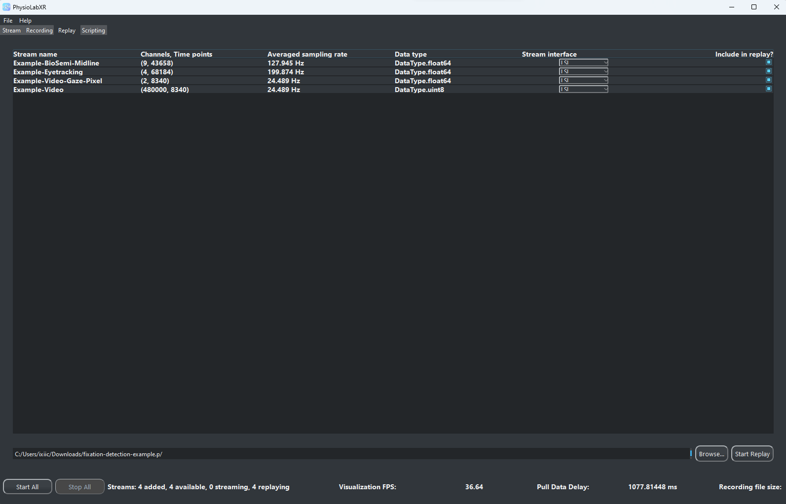

############
Replaying
############

PhysioLab\ :sup:`XR`'s replay feature enables users to play back data streams from past experiments.

If multiple streams were saved to the same recording, replay will synchronize their timestamps.

.. note::

    Replay is very helpful for testing data processing pipeline 'offline' in real-time as if an experiment is currently running,
    especially when used together with the `scripting interface <Scripting.html>`_,

Learn From a Simple Example How to Replay a Recording
*******************************************************
In this example, we will replay a real experiment with three streams: EEG, eyetracking, and video. This is the same data we use
un the `Fixation Detection Tutorial  <FixationDetection.html>`_, check it out if you want to learn how to detect `fixations <https://en.wikipedia.org/wiki/Fixation_(visual)>`_
from eye-tracking data.

1. First, we need recording file from PhysioLab\ :sup:`XR`. In this example, our experiment file is pickle format (read more about recording
file formats `here <Recording.html#supported-file-formats>`_).
To download the recording, click on `this link (~3.7 GB) <https://drive.google.com/file/d/1-1YCCO4by9xpYRrz17glX9llAeg__ftZ/view?usp=drive_link>`_.

.. raw:: html

    

        <video id="autoplay-video1" autoplay controls loop muted playsinline style="position: absolute; top: 0; left: 0; width: 100%; height: 100%;">
            <source src="_static/Replay1.mp4" type="video/mp4">
            Your browser does not support the video tag.
        </video>
    

2. Now open PhysioLab\ :sup:`XR` and navigate to the ``Replay`` tab. Click on the ``Browse`` button and select the downloaded file.
Wait a few seconds for the replay server to load the file,
after that you should see a table showing info of this recording. It should look like this:

Let's take a closer look at what each column of this table means:

- *Stream name*: The name of the streams contained in this recording.

- *Channels, Time points*: The number of channels and time points in the stream, respectively.

- *Averaged sampling rate*: The averaged sampling rate of the stream calculated from :math:`\frac{number\ of\ time\ points\ (in\ samples)}{duration\ of\ the\ stream\ (in\ seconds)}`. Note that this
  is just for reference and could be different from the actual sampling rate of the stream, especially when the stream's sample rate is not fixed such as an event marker. But
  a stream with 0 Hz would there is no data in this stream.

- *Data type*: The data type of the stream. This is contained in the recording file.

- *Stream interface*: The interface API to send the stream for replay. The currently version of PhysioLab\ :sup:`XR` supports two interfaces: *LSL* and *ZMQ*.
  You can choose
  whichever interface to replay the stream, regardless of how you recorded the data in the first place.
  When you select *ZMQ* interface,
  a port number line edit will pop up. You can edit whatever port number you want, but note that some ports are reserved for the operating
  system and other applications. Generally the default ports should work. Check out `this section <DataStreamAPI.html#choosing-zmq-ports>`_
  on how to choose a port number.
  This port number *stream tab*.

.. note::

    We recommend using *ZMQ* for streams that has a large number of channels such as video streams for smoother performance.

- *Include in replay*: use this checkbox to set whether this stream will be included in the replay. Only checked streams will be included in the replay.

3. Now, we can kick off the replay by clicking on the ``Start Replay`` button. Replay server will create the LSL outlets and ZMQ sockets to stream out the data.
You will be taken back to the *Stream Tab* with the replay streams automatically added. A Playback window showing the
progress bar of the replay. You can pause the replay by clicking on the **Pause** button and resume it by clicking on the **Resume** button. You can also drag the progress bar to
to jump to that position in the replay.

.. note::

    At the start of replay, PhysioLab\ :sup:`XR` will automatically add the streams when you start the replay with the *stream interface* you have chosen. But if a stream is already added in the
    *Stream Tab* with a different networking interface, you will need to remove that stream and add it again with its network interface matching the one you selected in replay. If you are using ZMQ,
    you also have to make sure the port number is correct (read more about data stream API `here <DataStreamAPI.html#choosing-which-data-stream-api-to-use>`_).

4. Click on the *Start all* button on the bottom left corner to start receive the streams and plotting them.
You should see the EEG data and eye-tracking data stream.

5. The video stream won't show without setting its display properties.
To do so, click on the :math:`\dots` button on the top right of *Example-Video* widget to bring up the *Options Window*.
It should have already selected *Image* as the `plotting format <Stream.rst#plotting-formats>`_ because of the large number of channels it has.
Put in *400* for both *Height* and *Width* to match the video's resolution. Select *bgr* in the *Image Dropdown*. Finally,
select *channel_first* in the *Channel format dropdown*. Return to the *Stream Tab*, move your cursor to the lower left of the
*Example-Video*'s plot, click the *[A]* button that shows up to have the plot auto-scale to fit the window.
Now you should see the video that was recorded from the experiment participant's first person view.

.. raw:: html

    

        <video id="autoplay-video1" autoplay controls loop muted playsinline style="position: absolute; top: 0; left: 0; width: 100%; height: 100%;">
            <source src="_static/Replay2.mp4" type="video/mp4">
            Your browser does not support the video tag.
        </video>
    

