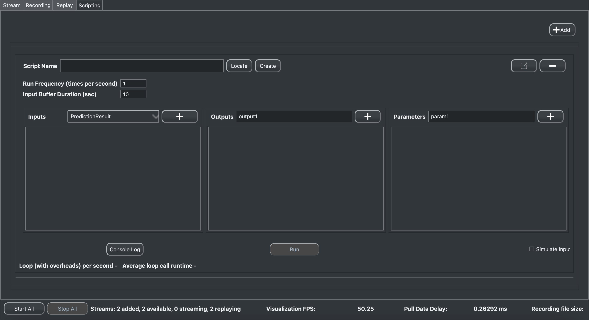

.. _feature scripting:

###################################
Scripting
###################################

The scripting interface, or RenaScript, is one of the most extensible features PhysioLabXR offers.
It empowers researchers to run user-defined Python scripts (Python is the only language supported right now), providing full agency for creating and deploying custom data processing pipelines.
With Python's versatility and vast array of fast-growing open-source libraries, users are encouraged to
creatively explore and experiment with novel applications such as close-loop neurofeedback.
Users can implement DSP algorithms, run ML models with real-time data streams,
or communicate with external applications such as a cloud-computing platform through Python APIs.

Learn From a Simple Example How to Create and Run a Processing Script
--------

.. automodule:: module_a
   :members:
   :undoc-members:
   :show-inheritance:

In this example, we will write a script to process our ``Dummy-8Chan`` stream: a randomly generated stream.

First, make sure you have the following packages installed in your Python environment:

- pylsl
- numpy

You can install them with ``pip install pylsl numpy``, or if you use a conda environment, you can install them with
``conda install -c conda-forge pylsl numpy``.

Create Stream
************

We will create a dummy stream to record. Create a new python file, put in the following snippet.

.. literalinclude:: LSLExampleOutlet.py
    :language: python
    :linenos:
    :lines: 1-100

Now run the script in your terminal with a command like ``python LSLExampleOutlet.py``. The script will start an LSL
stream with stream name 'Dummy-8Chan' and stream type 'EEG'. The stream will generate random data with 8 channels and
a sampling rate of 250 Hz. The stream will keep running until you stop the script.

Create Script
************

Now we will create a new python script to process out Dummy stream. Go to ``Scripting`` tab and click on the ``Add`` button.
A script widget containing some informations of the script should show up. It should look like this:

Let's take a closer look at what each component does:

- *Script Name*: The path of your script file on the system. You don't have to manually type in the path. To create a new script, click on the ``Create`` button beside and specify the path and the name of the script file. Then click save. Alternatively you can load existing scripts by clicking the ``Locate`` button.

- *Run Frequency (time per second)*: The maximum frequency the script will run at. The real running frequency won't necessarily be exactly the same, it can be limited by the performance of your device.

- *Input Buffer Duration (sec)*: The size of the buffer for receiving input data from network interfaces, in seconds. The buffer is implemented as a FIFO (First In First Out) queue and this parameter will determine the maximum data you can access to in during a loop of your script.

- *Inputs Pane*: Where you can add streams to your script as input. To add a stream as an input, you should first make sure it's already added in the ``stream`` tab. Added input streams can be accessed in the script using ``self.inputs[my_stream_name]``. Accessing the input gives a data matrix and the timestamp vector. The data matrix is of shape (f :sub:`nominal` ∗ T :sub:`bufferduration`, N :sub:`channels`), where f :sub:`nominal` is the nominal sampling rate, T :sub:`bufferduration` is the amount of data in seconds the buffer contains and N :sub:`channels` is the number of channels for this stream. The timestamp vector has f :sub:`nominal` ∗ T :sub:`bufferduration` items, each corresponding to a row of entries in the data matrix

- *Output Pane*: Where you can create output streams. An output is defined by the output stream name and its number of channels. The output stream will be broadcasted on the network through LSL or ZMQ per the user’s choice, allowing it to be visualized the same way as an external data source in the stream tab. Meanwhile, a script may take output streams from another script as input, thus creating a cascading pipeline. You can assign the data to transmit in your script by assigning ``self.outputs[my_stream_name]`` in your script.

- *Parameters Pane*: Where you can initiate variables that the user wishes to alter during runtime or variables that depend on the host computer (e.g., the path to a pre-trained ML model) when the researcher wants to avoid hardcoding these variables into the script. You can define parameters by their names, data type, and values. Then throughout the script, parameters are accessible using its name: ``self.params[my_parameter_name]``. Changes to parameter values will be reflected immediately in real time while the scripting is running.

- *Console Log*: The button to bring up console log

- *Run/Stop/Kill*: The button to run the script, it will change into stop when the script starts to run. When stop is clicked, the button will changed to kill, so you can kill the process manually if it's not closed automatically.

- *Simulate Input check box*: Check the box if you want to use randomly generated data for all your input streams.

- *Loop (with overheads) per second*: This is where you can monitor the performance of the script. The number shows how many seconds the script needed to run for one loop.

- *Average loop call runtime*: The average runtime of a loop.

After you create the script file, it's time to write the script. Let's start with a simple script that just add a constant value to the input.
Open the script file and you should see a template like this:

.. literalinclude:: BaseRenaScript.py
    :language: python
    :linenos:
    :lines: 1-100

- *init*: init is called once when the start button in the widget is clicked. This function is intended for the user to instantiate objects to be used later in the primary duty-cycle function: loop. Users may add routines such as defining variables, loading pre-trained parameters for an ML model from the file system, and connecting with servers and cloud platforms.

- *loop*: After init concludes, *loop* function will be called at *run frequency* is presumably the most often called function and uses the most processor time to continuously process input data and communicate with other processes via the outputs. At the same time, the user can tune the behavior by modifying the parameters.

- *cleanup*:  The cleanup is called when the stop button is clicked. Here, the user may free occupied memory, disconnect hardware ports and close any opened file system resources.

In this example, we will only be writing the loop function.

1. we retrive the input data from the input buffer:

.. code-block:: python

    input_data = self.inputs.get_data('Dummy-8Chan')

2. we add a constant value to the input data as a parameter that is tunable during runtime, and assign the output data to the output stream:

.. code-block:: python

    self.outputs['Dummy-8Chan-add-X'] = input_data - self.params['x']

3. clean up the buffer by calling the clear_buffer API function:

.. code-block:: python

    self.inputs.clear_buffer()

4. The clear_buffer function will not only clear the data (which is a value of a dict in the buffer), but also delete the stream key from the input buffer. So in every loop, we need to check if the stream is still in the buffer. If not, we will return until the stream is received again:

.. code-block:: python

    if 'Dummy-8Chan' in self.inputs.buffer.keys() :
        input_data = self.inputs.get_data('Dummy-8Chan')
        print(input_data)
        print('Loop function is called')
        self.outputs['Dummy-8Chan-add-X'] = input_data + self.params['x']
        self.inputs.clear_buffer()

The final script should look like this:

.. code-block:: python

    import numpy as np

    from physiolabxr.scripting.RenaScript import RenaScript

    class ScriptName(RenaScript):
        def __init__(self, *args, **kwargs):
            """
            Please do not edit this function
            """
            super().__init__(*args, **kwargs)

        # Start will be called once when the run button is hit.
        def init(self):
            print('Init function is called')
            pass

        # loop is called <Run Frequency> times per second
        def loop(self):

            if 'Dummy-8Chan' in self.inputs.buffer.keys() :
                input_data = self.inputs.get_data('Dummy-8Chan')
                print(input_data)
                print('Loop function is called')
                self.outputs['Dummy-8Chan-add-X'] = input_data + self.params['x']
                self.inputs.clear_buffer()

        # cleanup is called when the stop button is hit
        def cleanup(self):
            print('Cleanup function is called')

Run the script
**************

After you finish writing the script, go back to the ``scripting`` tab, type *Dummy-8Chan* in the input stream box, and click the add button. Then type *Dummy-8Chan-add-X* in the output stream box, and click the add button. Now you should see the input stream and output stream in the input and output pane respectively. You can also add parameters in the parameters pane. In this example, we will add a parameter called *x* with data type *float* and default value *0*. Now you can click the run button and see the output stream in the stream tab. Change the parameter value and you will see the output stream change accordingly.

More Examples
*************

If you want to some more involved examples
on building data processing script for experiments and BCI, check out these tutorials:

`FixationDetection <FixationDetection.html>`_

:ref:`Multi-modal Event-related Potential Classifier <tutorial multi-modal erp Classifier>`

.. _tutorial how to use scripting for device:
Create your data source using Scripting Interface
---------------------------------------------------------------------

Most of the sensors and devices connect to your computer via USB or Bluetooth, and you can print the data to the console using the SDK provided by the device manufacturer.
This is a good way to test the device and get familiar with the data.
However, if you want to use the data in your experiment and synchronize it with other data streams, you will need to use **time.time()** to get the timestamp of the data and write the data to a file.
This could be a tedious process and you will need to do it for every device you want to use.

The :ref:`Scripting Interface <feature scripting>` in Physiolab\ :sup:`XR` can be used as a agent between the device driver and LSL or ZMQ streams.
In general, you can initialize third party device driver for the target device in the **init()** function and get the data in the **loop()** function and boardcast it to LSL or ZMQ streams.

OpenBCI Cyton 8 channels EEG device
************************************

In this section, we will show you how to create a custom data source for `OpenBCI Cyton 8 channels EEG device <https://docs.openbci.com/GettingStarted/Boards/CytonGS/>`_ using the scripting interface and
the third party open source library `BrainFlow <https://brainflow.readthedocs.io/en/stable/SupportedBoards.html#cyton>`_.

1. import libraries

.. code-block:: python

    import time

    import brainflow
    import pylsl
    from brainflow.board_shim import BoardShim, BrainFlowInputParams
    from physiolabxr.scripting.RenaScript import RenaScript

2. Initialize the device interface in the **init()** function

.. code-block:: python

    # Start will be called once when the run button is hit.
    def init(self):
        # check if the parameters are set

        if "serial_port" not in self.params: # check
            while True:
                print("serial_port is not set. Please set it in the parameters tab (e.g. COM3)")
                time.sleep(1)
        else:
            if type(self.params["serial_port"]) is not str:
                while True:
                    print("serial_port should be a string (e.g. COM3)")
                    time.sleep(1)

        print("serial_port: ", self.params["serial_port"])

        # try init board
        self.brinflow_input_params = BrainFlowInputParams()

        # assign serial port from params to brainflow input params
        self.brinflow_input_params.serial_port = self.params["serial_port"]

        self.brinflow_input_params.ip_port = 0
        self.brinflow_input_params.mac_address = ''
        self.brinflow_input_params.other_info = ''
        self.brinflow_input_params.serial_number = ''
        self.brinflow_input_params.ip_address = ''
        self.brinflow_input_params.ip_protocol = 0
        self.brinflow_input_params.timeout = 0
        self.brinflow_input_params.file = ''

        # set board id to Cyton 8-channel (0)
        self.board_id = 0 # Cyton 8-channel

        try:
            self.board = BoardShim(self.board_id, self.brinflow_input_params)
            self.board.prepare_session()
            self.board.start_stream(45000, '') # 45000 is the default and recommended ring buffer size
            print("OpenBCI Cyton 8 Channels. Sensor Start.")
        except brainflow.board_shim.BrainFlowError:
            while True:
                print('Board is not ready. Start Fild. Please check the serial port and try again.')
                time.sleep(1)

The **BoardShim** class is the main class to handle the board. The first parameter is the board id, which is 0 for Cyton 8-channel. The second parameter is the **BrainFlowInputParams** class, which is used to set the serial port.
The detailed documentation for those classes can be found in the `BrainFlow documentation <https://brainflow.readthedocs.io/en/stable/>`_.

Instead of hard coding the serial port number in the script, we can use the **self.params** dictionary to set the serial port in the **Parameters** tab. The **init()** function will be called when the run button is hit. If the serial port is not set, the script will wait until the serial port is set in the **Parameters** tab.
If the serial port is set, the script will try to initialize the board. If the board is not ready, the script will stuck in the while loop and the user will need to stop the script and set the serial port again.

    The **serial_port** parameter should be a string, e.g. COM3 for Windows and /dev/ttyUSB0 for Linux. You can find the serial port number in the device manager in Windows and using the **ls /dev/ttyUSB*** command in Linux.

3. Get the data in the **loop()** function and send it to LSL stream

.. code-block:: python

    # loop is called <Run Frequency> times per second
    def loop(self):
        timestamp_channel = self.board.get_timestamp_channel(0)
        eeg_channels = self.board.get_eeg_channels(0)
        # print(timestamp_channel)
        # print(eeg_channels)

        data = self.board.get_board_data()

        timestamps = data[timestamp_channel]
        data = data[eeg_channels]

        absolute_time_to_lsl_time_offset = time.time() - pylsl.local_clock()
        timestamps = timestamps - absolute_time_to_lsl_time_offset # remove the offset between lsl clock and absolute time
        self.set_output(stream_name="OpenBCICyton8Channels", data=data, timestamp=timestamps)

In this example, the **get_timestamp_channel()** and **get_eeg_channels()** functions are used to get the index of timestamp channel and EEG channels.
The **get_board_data()** function is used to get all the dataframes from the buffer. The shape of the data is a 2D array with the first dimension being the number of frames and the second dimension being the number of channels.
OpenBCI Cython 8 channels use the unix timestamp, so we need to remove the offset between the unix timestamp and the LSL clock.
The **set_output()** function is used to boardcast the data to the LSL stream with the name **OpenBCICyton8Channels**.

    The complete script can be downloaded from `PhysioLabXROpenBCICyton8ChannelsScript.py <https://github.com/PhysioLabXR/PhysioLabXR/blob/master/physiolabxr/scripting/Examples/PhysioLabXR_P300Speller_Demo/PhysioLabXROpenBCICyton8ChannelsScript.py>`_.

To run the script, please refer to :ref:`Start OpenBCI Cyton-8-Channels <start the openbci cyton 8 channels board from physiolabxr scripting interface using physiolabxropenbcicyton8channelsscript.py>`
in the :ref:`P300 Speller Tutorial<tutorial p300>`.

