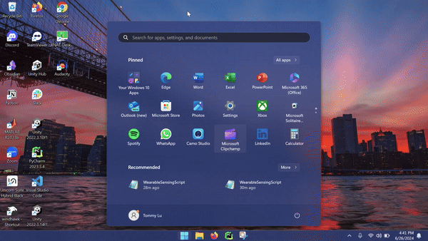
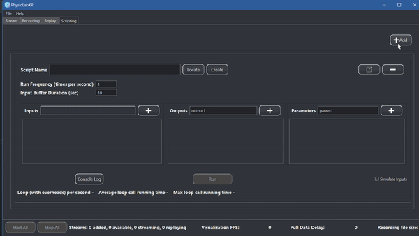
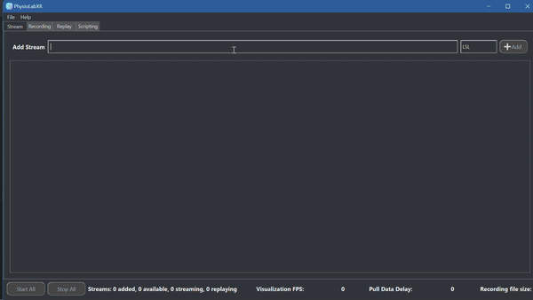
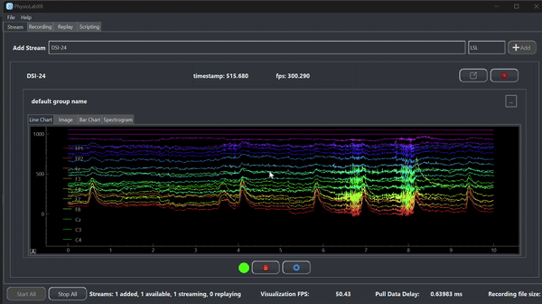

.. _Wearable Sensing Stream:

##################################################
PhysioLab\ :sup:`XR` + Wearable Sensing's DSI-24
##################################################

This tutorial will demonstrate how to connect the DSI-24 to your computer and PhysioLab\ :sup:`XR`.
The `DSI-24 <https://wearablesensing.com/dsi-24/>`_ is `Wearable Sensing's <https://wearablesensing.com/>`_ dry electrode EEG system.
This tutorial will be primarily focused on the Windows platform

1. Turn on the `DSI-24 <https://wearablesensing.com/dsi-24/>`_.

2. Go to Device Manager.

3. Expand the Bluetooth section.

4. Disable Intel(R) Wireless Bluetooth(R) or whatever is your default Bluetooth driver.

.. figure:: media/WearableSensing_BluetoothDisable.gif
   :width: 800
   :align: center
   :alt: Turning off native Bluetooth

5. Plug in the Bluetooth adapter provided by `Wearable Sensing's <https://wearablesensing.com/>`_.

6. Go to Bluetooth settings.

7. Scroll down to device settings.

8. Turn the Bluetooth devices discovery setting from Default to Advanced. (If you are on Windows 10, this step can be ignored).

5. Plug in the Bluetooth adapter provided by Wearable Sensing

6. Go to Bluetooth settings

7. Scroll down to device settings

8. Turn the Bluetooth devices discovery setting from Default to Advanced. (If you are on Windows 10, this step can be ignored)

.. figure:: media/WearableSensing_BluetoothDeviceDiscovery.gif
   :width: 800
   :align: center
   :alt: Turning on Bluetooth Device Discovery

9. Connect the `DSI-24 <https://wearablesensing.com/dsi-24/>`_ to your device as if you would connect a mouse or headphones. (Should be named DSI24-{*serial number*}).

10. Go back to Bluetooth Settings.

11. Scroll down to more Related Settings.

12. Click on more Bluetooth Settings.

13. Click on COM Ports and make note of the COM port number that has the name: DSI24-{*serial number*} "Bluetooth Serial Port".

14. Connect the DSI-24 to your device as if you would connect a mouse or headphones. (Should be named DSI24-{*serial number*})

15. Go back to Bluetooth Settings

16. Scroll down to more Related Settings

17. Click on more Bluetooth Settings

18. Click on COM Ports and make note of the COM port number that has the name: DSI24-{*serial number*} "Bluetooth Serial Port"

19. Open PhysioLab\ :sup:`XR`.

20. Go to `Script Tab <Scripting.html>`_.

21. Click *Locate* and find the WearableSensingScript.py.

The script can be downloaded from `WearableSensingScript.py <https://github.com/LommyTea/WearableSensingXPhysioLabXR/blob/main/WearableSensingScript.py>`_.

.. code-block:: python

    from pylsl import local_clock
    from physiolabxr.scripting.RenaScript import RenaScript
    from physiolabxr.thirdparty.WearableSensing.DSI_py3 import *
    import numpy as np
    import sys
    from physiolabxr.utils.buffers import DataBuffer

    #Creating a data buffer with the DataBuffer class
    data_buffer = DataBuffer()

    is_first_time = True
    time_offset = 0  # time offset for the first packet to the local_clock()
    @SampleCallback
    def ExampleSampleCallback_Signals(headsetPtr, packetTime, userData):
        #This is the function that will be called every time a new packet is received
        global data_buffer
        global is_first_time
        global time_offset

        #Grab the headset by using a pointer
        h = Headset(headsetPtr)
        #Get the signal from each channel and format it so that it can be created into an array
        new_data = np.array(['%+08.2f' % (ch.GetSignal()) for ch in h.Channels()])
        #Reshapes the array into a 24x1 array so that it can be inputted into the data_buffer
        new_data = new_data.reshape(24,1)
        #Rearrange new_data to fit with desired output format
        new_data = new_data[[9, 10, 3, 2, 4, 17, 18, 7, 1, 5, 11, 22, 12, 21, 8, 0, 6, 13, 14, 20, 23, 19, 15, 16], :]
        #Get the time of the packet as a temporary solution to timestamps
        if is_first_time:
            time_offset = local_clock() - float(packetTime)
            is_first_time = False

        t = [float(packetTime) + time_offset]
        if new_data.shape[1] != len(t):
            print('Data and timestamp mismatch')
            print(new_data.shape)
            print(len(t))

        #Create a dictionary with the stream name, data, and timestamps
        new_data_dict = {
            'stream_name': 'DSI-24',
            'frames': new_data,
            'timestamps': t
        }
        #Update the data buffer with the new data
        data_buffer.update_buffer(new_data_dict)
    class DSI24(RenaScript):
        def __init__(self, *args, **kwargs):
            """
            Please do not edit this function
            """
            super().__init__(*args, **kwargs)

        def init(self, arg = ''):
            #Create a headset object
            self.headset = Headset()
            #Set the message callback to ExampleMessageCallback
            self.headset.SetMessageCallback(ExampleMessageCallback)
            #Retrieves the command line arguments
            args = getattr(sys, 'argv', [''])
            #Set the default port to the first command line argument based on the parameter provided by user
            default_port = self.params['COM Port']
            #Connect the headset
            self.headset.Connect(default_port)
            #Start the data acquisition based on the parameter provided by user
            if arg.lower().startswith('imp'):
                #Currently not used
                self.headset.SetSampleCallback(ExampleSampleCallback_Impedances, 0)
                self.headset.StartImpedanceDriver()
            else:
                #Set the sample callback to ExampleSampleCallback_Signals
                self.headset.SetSampleCallback(ExampleSampleCallback_Signals, 0)
                if len(arg.strip()): self.headset.SetDefaultReference(arg, True)
            #Start the data acquisition
            self.headset.StartBackgroundAcquisition()

        def loop(self):
            #Called every loop based on the user's chosen frequency
            global data_buffer
            #If the data buffer has data, then set the output to the data buffer
            if len(data_buffer.keys()) > 0:
                self.set_output(stream_name = 'DSI-24', data = data_buffer.get_data('DSI-24'), timestamp = data_buffer.get_timestamps('DSI-24'))
                #Clear the data buffer
                data_buffer.clear_stream_buffer_data('DSI-24')

        def cleanup(self):
            #Called when the script is stopped
            global data_buffer
            global is_first_time
            global time_offset
            #Stop the data acquisition
            self.headset.StopBackgroundAcquisition()
            #Disconnect the headset
            time_offset = 0
            is_first_time = True
            self.headset.Disconnect()
            data_buffer.clear_buffer()

22. *Add* an output and name it "DSI-24".

23. Change the number of channels to 24.

24. *Add* a **Parameter Widget** to the script by clicking on the + sign.

25. Change the name of the parameter to *COM Port* and switch the type of input to "str" so that we can input the COM port.

26. Input the name of the COM port that you noted earlier. This will allow for PhysioLabXR to connect to the DSI-24.

27. Press *Run*.

Now the data stream is available as an LSL stream named DSI-24.

28. To view the data stream, go to the **Stream Tab**.

29. Input *DSI-24* in the Add Stream box and press the *Add Widget* button.

30. Click the *Start Button* to start data stream.

It is recommended that you change some of the settings for your stream. You can follow the steps `here <https://physiolabxrdocs.readthedocs.io/en/latest/Visualization.html#line-chart>`_ to change the settings.
For this tutorial, we added a Butterworth High Pass Filter with a cutoff frequency of 0.01 Hz, Nominal Sampling Rate of 250 and Group Channels Constant Offset to 50 by first pressing on the Gear icon and then on the top Default Group name.

31. To see the FFT of the signals from the `DSI-24 <https://wearablesensing.com/dsi-24/>`_ right-click on the stream and select *FFT*.

Now that you have the data streaming: check out these docs:

- `How to record the data <https://physiolabxrdocs.readthedocs.io/en/latest/Recording.html>`_
- `How to run a classification model on the data <https://physiolabxrdocs.readthedocs.io/en/latest/tutorials/BuildMultiModalERPClassifier.html>`_

