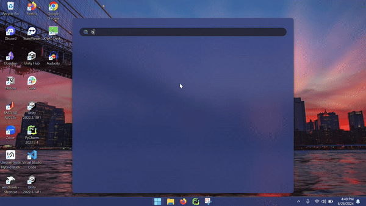

==================================================

PhysioLab\ :sup:`XR` + Wearable Sensing's DSI-24

==================================================

This tutorial will demonstrate how to connect the DSI-24 to your computer and PhysioLab\ :sup:`XR`.
<<<<<<< HEAD
The `DSI-24 <https://wearablesensing.com/dsi-24/>`_ is `Wearable Sensing's <https://wearablesensing.com/>`_ dry electrode EEG system.
This tutorial will be primarily focused on the Windows platform

1. Turn on the `DSI-24 <https://wearablesensing.com/dsi-24/>`_.

2. Go to Device Manager.

3. Expand the Bluetooth section.

4. Disable Intel(R) Wireless Bluetooth(R) or whatever is your default Bluetooth driver.
=======
The DSI-24 is Wearable Sensing's dry electrode EEG system.
This tutorial will be primarily focused on the Windows platform

1. Turn on the DSI-24

2. Go to Device Manager

3. Expand the Bluetooth section

4. Disable Intel(R) Wireless Bluetooth(R) or whatever is your default Bluetooth driver
>>>>>>> e4aec3299112339547fa9c7d0b53279af19cbc39

.. figure:: media/BluetoothDisable.gif
   :width: 800
   :align: center
   :alt: Disabling Bluetooth

<<<<<<< HEAD
5. Plug in the Bluetooth adapter provided by `Wearable Sensing's <https://wearablesensing.com/>`_.

6. Go to Bluetooth settings.

7. Scroll down to device settings.

8. Turn the Bluetooth devices discovery setting from Default to Advanced. (If you are on Windows 10, this step can be ignored).
=======
5. Plug in the Bluetooth adapter provided by Wearable Sensing

6. Go to Bluetooth settings

7. Scroll down to device settings

8. Turn the Bluetooth devices discovery setting from Default to Advanced. (If you are on Windows 10, this step can be ignored)
>>>>>>> e4aec3299112339547fa9c7d0b53279af19cbc39

<<<<<<< HEAD
9. Connect the `DSI-24 <https://wearablesensing.com/dsi-24/>`_ to your device as if you would connect a mouse or headphones. (Should be named DSI24-{*serial number*}).

10. Go back to Bluetooth Settings.

11. Scroll down to more Related Settings.

12. Click on more Bluetooth Settings.

13. Click on COM Ports and make note of the COM port number that has the name: DSI24-{*serial number*} "Bluetooth Serial Port".
=======
9. Connect the DSI-24 to your device as if you would connect a mouse or headphones. (Should be named DSI24-{*serial number*})

10. Go back to Bluetooth Settings

11. Scroll down to more Related Settings

12. Click on more Bluetooth Settings

13. Click on COM Ports and make note of the COM port number that has the name: DSI24-{*serial number*} "Bluetooth Serial Port"
>>>>>>> e4aec3299112339547fa9c7d0b53279af19cbc39

.. figure:: media/BluetoothCOMPort.gif
   :width: 800
   :align: center
   :alt: Finding the COM Port

<<<<<<< HEAD
14. Open PhysioLab\ :sup:`XR`.

15. Go to `Script Tab<Scripting.html>`_.

16. Click Locate and find the WearableSensingScript.py.

The script can be downloaded from `WearableSensingScript.py <https://github.com/LommyTea/WearableSensingXPhysioLabXR/blob/main/WearableSensingScript.py>`_.

.. code-block:: python

    from physiolabxr.scripting.RenaScript import RenaScript
    from physiolabxr.thirdparty.WearableSensing.DSI_py3 import *
    import numpy as np
    import sys
    from physiolabxr.utils.buffers import DataBuffer

    #Creating a data buffer with the DataBuffer class
    data_buffer = DataBuffer()

    @MessageCallback
    def ExampleMessageCallback(msg, lvl=0):
        if lvl <= 3:  # ignore messages at debugging levels higher than 3
            print("DSI Message (level %d): %s" % (lvl, IfStringThenNormalString(msg)))
        return 1

    @SampleCallback
    def ExampleSampleCallback_Signals(headsetPtr, packetTime, userData):
        #This is the function that will be called every time a new packet is received
        global data_buffer
        #Grab the headset by using a pointer
        h = Headset(headsetPtr)
        #Get the signal from each channel and format it so that it can be created into an array
        new_data = np.array(['%+08.2f' % (ch.GetSignal()) for ch in h.Channels()])
        #Reshapes the array into a 24x1 array so that it can be inputted into the data_buffer
        new_data = new_data.reshape(24,1)
        #Get the time of the packet as a temporary solution to timestamps
        t = [packetTime]
        #Create a dictionary with the stream name, data, and timestamps
        new_data_dict = {
            'stream_name': 'DSI-24',
            'frames': new_data,
            'timestamps': t
        }
        #Update the data buffer with the new data
        data_buffer.update_buffer(new_data_dict)

    @SampleCallback
    def ExampleSampleCallback_Impedances(headsetPtr, packetTime, userData):
        #Not yet used
        h = Headset(headsetPtr)
        fmt = '%s = %5.3f'
        strings = [fmt % (IfStringThenNormalString(src.GetName()), src.GetImpedanceEEG()) for src in h.Sources() if
                   src.IsReferentialEEG() and not src.IsFactoryReference()]
        strings.append(fmt % ('CMF @ ' + h.GetFactoryReferenceString(), h.GetImpedanceCMF()))
        print(('%8.3f:   ' % packetTime) + ', '.join(strings))
        sys.stdout.flush()

    class DSI24(RenaScript):
        def __init__(self, *args, **kwargs):
            """
            Please do not edit this function
            """
            super().__init__(*args, **kwargs)

        def init(self, arg = ''):
            #Create a headset object
            self.headset = Headset()
            #Set the message callback to ExampleMessageCallback
            self.headset.SetMessageCallback(ExampleMessageCallback)
            #Retrieves the command line arguments
            args = getattr(sys, 'argv', [''])
            #Set the default port to the first command line argument based on the parameter provided by user
            default_port = self.params['param1']
            #Connect the headset
            self.headset.Connect(default_port)
            #Start the data acquisition based on the parameter provided by user
            if arg.lower().startswith('imp'):
                #Currently not used
                self.headset.SetSampleCallback(ExampleSampleCallback_Impedances, 0)
                self.headset.StartImpedanceDriver()
            else:
                #Set the sample callback to ExampleSampleCallback_Signals
                self.headset.SetSampleCallback(ExampleSampleCallback_Signals, 0)
                if len(arg.strip()): self.headset.SetDefaultReference(arg, True)
            #Start the data acquisition
            self.headset.StartBackgroundAcquisition()

        def loop(self):
            #Called every loop based on the user's chosen frequency
            global data_buffer
            #If the data buffer has data, then set the output to the data buffer
            if len(data_buffer.keys()) > 0:
                self.set_output(stream_name = 'DSI-24', data = data_buffer.get_data('DSI-24'), timestamp = data_buffer.get_timestamps('DSI-24'))
                #Clear the data buffer
                data_buffer.clear_stream_buffer_data('DSI-24')

        def cleanup(self):
            #Called when the script is stopped
            global data_buffer
            #Stop the data acquisition
            self.headset.StopDataAcquisition()
            #Disconnect the headset
            data_buffer.clear_buffer()

17. Add an output and name it "DSI-24".

18. Change the number of channels to 24.

17. Add a parameter to the script by clicking on the + sign.

18. Switch the type of input to "str" so that we can input the COM port.

19. Input the name of the COM port that you noted earlier. This will allow for PhysioLabXR to connect to the DSI-24.

20. Press run.
=======
14. Open PhysioLab\ :sup:`XR`

15. Go to Scripting

16. Click Locate and find the WearableSensingScript.py

17. Add an output and name it DSI-24

18. Change the number of channels to 24

17. Add a parameter to the script by clicking on the + sign

18. Switch the type of input to "str"

19. Input the name of the COM port that you noted earlier

20. Press run
>>>>>>> e4aec3299112339547fa9c7d0b53279af19cbc39

.. figure:: media/PhysioLabXR_DSI24.gif
   :width: 800
   :align: center
   :alt: Running in PhysioLabXR

<<<<<<< HEAD
Now the data stream is available as an LSL stream named DSI-24.

21. To view the data stream, go to the **Stream Tab**.

22. Input "DSI-24" in the Add Stream box and press the *Add* button.

23. Click the *Start Button* to start data stream.

.. figure:: media/StreamingTab.gif
   :width: 800
   :align: center
   :alt: Viewing the stream on the Stream Tab

Now that you have the data streaming: check out these docs:

- `How to record the data <https://physiolabxrdocs.readthedocs.io/en/latest/Recording.html>`_
- `How to run a classification model on the data <https://physiolabxrdocs.readthedocs.io/en/latest/tutorials/BuildMultiModalERPClassifier.html>`_

=======
>>>>>>> e4aec3299112339547fa9c7d0b53279af19cbc39
(Future updates on impedance checks and other features explained further down)

