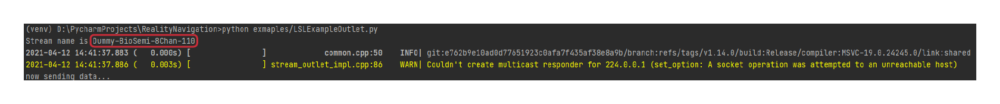

.. RealityNavigationDocs documentation master file, created by
   sphinx-quickstart on Wed Mar 24 13:36:31 2021.
   You can adapt this file completely to your liking, but it should at least
   contain the root `toctree` directive.

Welcome to RealityNavigation's documentation!
=================================================

About Reality Navigation
========================
Reality Navigation (RNApp) is a Python-based App for visualizing, synchronizing, recording, and processing (i.e., make prediction)
on lab data streams, camera, and screen capture in real-time.

RNApp is powered by `Lab Streaming Layer (LSL) <https://labstreaminglayer.readthedocs.io/info/intro.html>`_
in network communication, with which users may easily integrate RNApp into their data analysis pipeline if
they are already using LSL.

Quick Start
-----------

.. note::
   This App is still in alpha development build. Currently there's no packaged executable. Please follow this guide below
   to learn how to build and run the App.

Download the project from `RealityNavigation's repo page <https://github.com/ApocalyVec/RealityNavigation>`_.

RealityNavigation App requires python3.7+.

Navigation to the root folder of the downloaded repo, install all the prerequisites with the following command::

   pip install -r requirements.txt

Run main.py to start the app::

   python main.py

On launching, the landing page of the App is:

.. image:: media/RN_landing_page.png
    :width: 500

, where you can add webcam, screen capture, and `LSL data stream <https://labstreaminglayer.readthedocs.io/info/intro.html>`_:

.. image:: media/RN_add_stream.png
    :width: 500

Below is an example of RNApp monitoring eye tracking, head movement, and event marker for an experiment.

.. raw:: html

    

        <iframe src="_static/RN_multistream.mp4" frameborder="0" allowfullscreen style="position: absolute; top: 0; left: 0; width: 100%; height: 100%;"></iframe>
    

You can start testing your build with a dummy stream. Run this command from the repo's root to start an dummy stream::

   python exmaples/LSLExampleOutlet.py

Copy the stream name (yours might be different) paste it in 'Define a Stream to Add' in RNApp.

Then you should see the visualization of this dummy stream, which is sampled at 100Hz, with random numbers:

.. raw:: html

    

        <iframe src="_static/RN_dummy_stream.mp4" frameborder="0" allowfullscreen style="position: absolute; top: 0; left: 0; width: 100%; height: 100%;"></iframe>
    

This covers the basic interaction of visualizing data streams and add camera captures. Read on to learn how to record synchronized
data streams, adding your own devices, and other information.

- Cross platform support
   The App supports Windows 10, MacOS, and most Linux distros (tested on Ubuntu 20.04 and Fedora 33).
   You will need to install the headless version of cv2 if you encountered xcb platform plugin not found problem, install with::

      pip install opencv-python-headless

Further Information
-------------------
.. toctree::
   :maxdepth: 1
   :caption: Contents:

   Recording
   SupportedSensors
   ContributeToThisDoc
   LICENSE

Indices and tables
==================

* :ref:`genindex`
* :ref:`modindex`
* :ref:`search`
